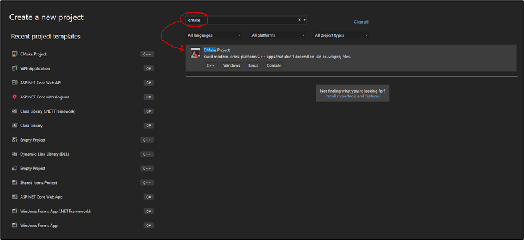
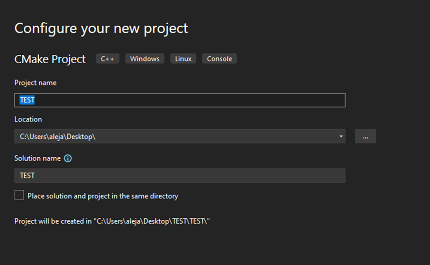
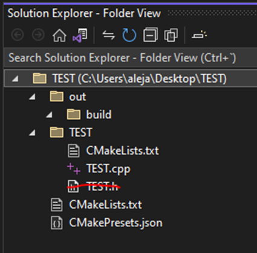
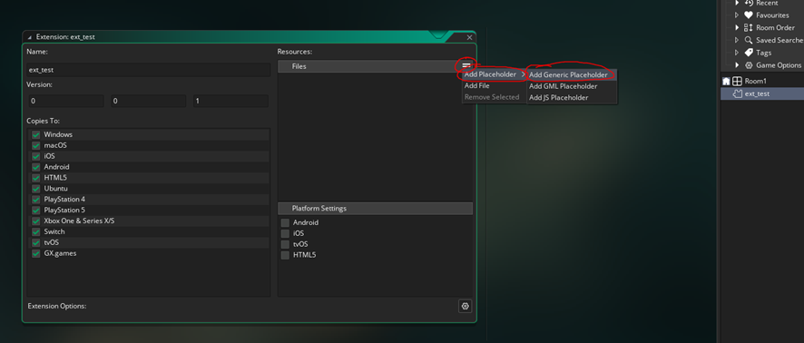
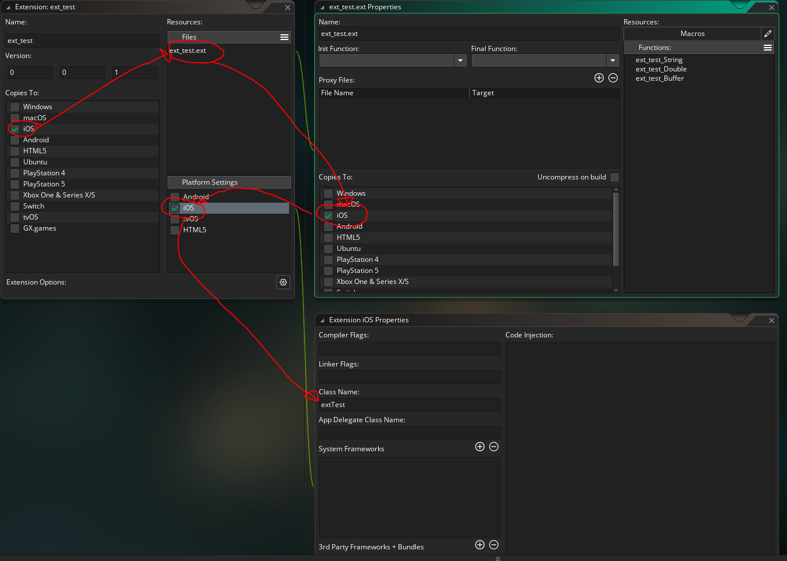

创建一个适用于Windows、Ubuntu（Linux）、Android、MacOS和iOS的GMS C++扩展 -> 使用Visual Studio和CMake

你好！

我的名字是Alex。

今天，我为大家带来一个非常完整的教程，该教程将详细解释如何从相同的C++源代码创建一个在以下平台上都能运行的扩展：

- Windows
- Ubuntu（Linux）
- Android
- MacOS
- iOS

这个指南将向你展示如何在所有这些平台上轻松处理字符串、双精度数（这是GMS扩展常见的数据类型）以及如何使用[缓冲区](https://manual.yoyogames.com/GameMaker_Language/GML_Reference/Buffers/Buffers.htm)！这个指南假设你正在使用Windows操作系统和Visual Studio Community 2022（或者任何其他Visual Studio许可证）。强烈建议你按照指南的顺序进行操作（直到开始讨论针对特定平台编译的部分），这样你就能理解所有基本原理以及为什么某些事情以某些特定的方式进行。

**注意：** 如果你有任何疑问或想提出建议，可以写评论，给我发论坛消息，或发邮件到[alejandroibrahimojea@gmail.com](mailto:alejandroibrahimojea@gmail.com)。

**注意 2：** 这个指南必须分为两个部分。第二部分可以在[这里](AGuidetoGenericC++Extensions2.md)找到。

## 一切的起源

基本上，我想制作一个类似Alchemy的游戏。问题是？在GMS中没有办法使用真实的SQL语法或使用任何类型的数据库引擎。

我的目标是使用一个轻量级的引擎，所以我把注意力放在了使用官方的SQLite3 C++源代码上。

经过一段时间，我逐渐发现了如何制作一个能够在所有提到的平台上使用SQLite3的C++扩展程序，它就像一个桥梁，让SQLite3在GMS中运行。

我所有工作的最终结果可以在[这个Itch.io链接](https://eternal-code-studio.itch.io/ecs-sqlite-3-for-gms)中找到，在那里你会找到我的扩展的最新版本，可以通过GMS使用真实的SQL语法和SQLite3数据库。

由于创建了这个扩展，我能够创建我的游戏Coniucta，可以在Google Play Store通过[这个链接](https://play.google.com/store/apps/details?id=com.ECS.Coniucta)获取。


## 设置Visual Studio以创建扩展

无论你要为哪个平台构建你的扩展，这些第一步都是一样的。

首先... 确保你的Windows操作系统上安装了Visual Studio Community 2022。你需要在Visual Studio Installer中确保安装了“使用C++进行桌面开发”包，因为这个包将允许我们创建一种称为CMake的项目类型。

CMake将允许我们从C++源代码编译出制作扩展所需的文件，以用于不同的平台。

一旦确保你已经安装了带有“使用C++进行桌面开发”包的Visual Studio Community，请打开VSC并创建一个新项目 > CMake。你应该看到下面的图片所示的内容：



然后设置项目名称和保存位置，并点击创建。 **重要提示:** 确保你的项目名称不要使用空格或特殊字符，因为这可能会在某些平台上导致编译错误。



设置完成后，你的项目将准备就绪。你可以删除预先创建的 .h 文件，因为我们不需要它：



在 CMakeLists.txt 文件中，你需要打开它并编辑包含你的 .h 文件的那一行(在这种情况下是 add_executable (TEST "TEST.cpp" "TEST.h") )，删除“Test.h”部分。

此外，你必须将 add_executable 更改为 add_library，因为我们将要编译的是创建一个库。你还必须添加 "SHARED" 部分，这样它就会创建正确的库类型。你的代码应该像这样：

add_library (TEST SHARED "TEST.cpp")

在你的 .cpp 文件中，你可以清除所有内容，并添加以下两个代码块。第一个代码块将允许你轻松地将你的 C++ 函数公开，以便被 GMS 调用和使用：

```cpp
#ifdef _WIN64
    #define GMS2EXPORT extern "C" __declspec(dllexport)
#else
    #define GMS2EXPORT extern "C"
#endif
```

接下来，你应该添加以下内容，这将允许你解释指向缓冲区的指针，这些缓冲区将由 GMS 作为字符串传递，以便在所有平台上都兼容：

```cpp
#include <cstring>
#include <string>
using namespace std;
char* getGMSBuffAddress(char* _GMSBuffPtrStr) {
    /*
        @description    将GMS缓冲区地址字符串转换为C++中可用的指针。
        @params         {char*} _GMSBuffPtrStr - GMS缓冲区的指针作为字符串。
        @return         {char*} 缓冲区的指针。现在像memcpy这样的函数将起作用。
    */
    size_t GMSBuffLongPointer = stoull(_GMSBuffPtrStr, NULL, 16);//将指针字符串转换为int64_t。
    return (char*)GMSBuffLongPointer;//将int64_t指针转换为char*并返回，以便可以在C++中操作缓冲区。
}
```

你完整的初始模板代码应该是这样的，才能开始工作：

```cpp
#ifdef _WIN64
    #define GMS2EXPORT extern "C" __declspec(dllexport)
#else
    #define GMS2EXPORT extern "C"
#endif
#include <cstring>
#include <string>
using namespace std;
char* getGMSBuffAddress(char* _GMSBuffPtrStr) {
    /*
        @description    将GMS缓冲区地址字符串转换为C++中可用的指针。
        @params         {char*} _GMSBuffPtrStr - GMS缓冲区的指针作为字符串。
        @return         {char*} 缓冲区的指针。现在像memcpy这样的函数将起作用。
    */
    size_t GMSBuffLongPointer = stoull(_GMSBuffPtrStr, NULL, 16);//将指针字符串转换为int64_t。
    return (char*)GMSBuffLongPointer;//将int64_t指针转换为char*并返回，以便可以在C++中操作缓冲区。
}
```


## 在GMS中设置扩展

我们的策略是创建一个使用通用占位符的扩展，这样你就不必从头编写所有可用的函数，只需编写一次即可。前往GMS，创建一个新的扩展，并添加一个通用占位符，如下所示：



通过这个简单的步骤，你就可以开始创建你自己的扩展了。

## 如何处理不同的数据类型

如前所述，GMS只能通过扩展与字符串和双精度数一起工作，这相当有限。然而，除了这两种数据类型外，你还可以提供指向内存位置的指针来处理缓冲区，但是有一个注意事项，当在GMS之外使用缓冲区时，无论使用何种类型的缓冲区，你都无法调整其大小或在其尺寸之外写入数据，因为这将导致严重的崩溃。

这部分将向你展示如何为所有平台定义字符串、双精度数以及如何传递缓冲区，但是对于Android和iOS，还有一些额外的步骤，将在"编译为..."中对这些特定平台进行解释。

所以让我们从你需要的初始信息开始...

当向扩展中添加新函数时，在GMS中的"External Name"必须与C++中的函数名匹配。

### 处理字符串

如果你想将字符串作为参数的一部分发送（并返回相同的字符串），在GMS中你必须这样定义：


然后在C++代码中，你可以创建一个以字符串作为参数的函数，如下所示：

```cpp
GMS2EXPORT char* ext_test_String(char* _myArgument0) {
    return (char*)_myArgument0;
}
```

之前的例子接受一个字符串作为参数，并将返回相同的字符串。

这个函数可以通过在GMS中进行以下操作来测试:

```gml
show_debug_message(ext_test_String("my sample string :D"));
```

应该显示一个带有传递参数的调试消息。

### 处理双精度数

如果你想要一个返回双精度数并接受双精度数作为参数的函数，GMS中的过程是相同的，你需要定义一个返回类型为双精度数，参数类型为双精度数的新函数。例如，在C++中，函数应该以以下方式定义：

```cpp
GMS2EXPORT double ext_test_Double(double _myArgument0) {
    return (double)_myArgument0;
}
```

这个函数将返回作为参数传递的双精度数。在GMS中调用它，你可以这样做：

```gml
show_debug_message(ext_test_Double(13));
```

这应该显示一个带有传递参数的调试消息。

### 处理缓冲区（更复杂的数据类型）

缓冲区基本上允许你存储除了字符串和双精度数之外的各种数据类型。

你可以在GMS中创建一个脚本，充当桥梁，负责所有创建缓冲区、将其传递给扩展，然后释放缓冲区以避免内存泄漏的过程。

为此，以下是一个完整的工作示例的基本示例。

在GMS扩展中，定义一个名为"ext_test_Buffer"的新函数，它返回一个双精度数（我们将使用双精度数来返回1，如果函数执行正常）并接受一个字符串类型的参数。

在GMS中创建一个脚本，并添加以下代码：

```gml
function f_bufferTestFromExt(){
    var _myBuff=buffer_create(2+4,buffer_fixed,1);//创建一个大小为6的缓冲区，它将允许我们存储一个无符号短整数（大小为2字节）和一个无符号整数（大小为4字节）
    var _myBuffAddress=string(buffer_get_address(_myBuff));//获取缓冲区的地址（作为字符串），它将被传递给扩展，以便它可以处理它
    var _response=ext_test_Buffer(_myBuffAddress);//调用扩展的函数并获取响应值（双精度数）
    show_debug_message("RESPONSE FROM : "+string(_response));//显示响应值的消息
    show_debug_message("SHORT INT VALUE: "+string(buffer_read(_myBuff,buffer_u16)));//显示第一个读取值（短整数）的调试消息
    show_debug_message("UNSIGNED INT VALUE: "+string(buffer_read(_myBuff,buffer_u32)));//显示第二个读取值（无符号整数）的调试消息
    buffer_delete(_myBuff);//删除缓冲区以避免内存泄漏
    return _response;//返回响应值
}
```

在C++代码中，你应该这样做：

```cpp
GMS2EXPORT double ext_test_Buffer(char* _GMSBuffPtrStr) {
    char* _GMSBuffer = getGMSBuffAddress(_GMSBuffPtrStr);//解释来自GMS的字符串地址，以便由C++管理
    //现在你可以执行memcpy操作（或任何其他内存操作）到缓冲区中 :)

    unsigned int currentWriteOffset = 0;//一个值，用于知道我们需要写入缓冲区的偏移量
    unsigned short int myUnShortInt = 65533;//将要写入缓冲区的无符号短整数值（然后在GMS中以调试消息显示）。
    unsigned int myUnInt = 4294967293;//将要写入缓冲区的无符号整数值（然后在GMS中以调试消息显示）。

    memcpy(&_GMSBuffer[currentWriteOffset], &myUnShortInt, sizeof(myUnShortInt));//写入无符号短整数
    currentWriteOffset += sizeof(myUnShortInt);//增加偏移量以将数据写入缓冲区的正确位置
    memcpy(&_GMSBuffer[currentWriteOffset], &myUnInt, sizeof(myUnInt));//写入无符号整数

    return 1;//返回1，表示一切正常 :)
}
```

如果现在在GMS中调用函数"f_bufferTestFromExt()"，你应该看到三个调试消息显示：

> RESPONSE FROM : 1

> SHORT INT VALUE: 65533

> UNSIGNED INT VALUE: 4294967293

**重要提示：** 请注意，GMS中的扩展函数只能有4个不同类型（字符串或双精度数）的参数。如果函数有超过4个参数，它们都需要是相同的类型。


### 创建一个非常好的并且文档良好的扩展

这是一个建议，可以让你创建一个非常好的、用户友好的扩展，以便最终用户能够更好地使用它：不要让他们直接与GMS中的扩展函数交互。
相反，将这些函数设置为“隐藏”，这样它们就不会显示为建议使用的函数，然后创建一个带有[JSDoc](https://manual.yoyogames.com/The_Asset_Editors/Code_Editor_Properties/JSDoc_Script_Comments.htm)文档的脚本。
下面是一个带有所有先前创建的3个函数的文档准备好的脚本：

```gml
#region f_testString
    /// @function                f_testString(_stringToReturn)
    /// @description             将提供的字符串发送到扩展。扩展然后会回复与提供的相同值。
    /// @param {String}             _stringToReturn   将发送到扩展并之后返回的值。
    /// @return {String}
    /// @self
    function f_testString(_stringToReturn){
        var _response=ext_test_String(_stringToReturn);//执行字符串测试
        show_debug_message("扩展的响应: "+_response);//显示响应值的消息
        return _response;//返回响应值
    }
#endregion
#region f_testDouble
    /// @function                f_testDouble(_doubleToReturn)
    /// @description             将提供的双精度数发送到扩展。扩展然后会回复与提供的相同值。
    /// @param {Real}             _doubleToReturn   将发送到扩展并之后返回的值。
    /// @return {Real}
    /// @self
    function f_testDouble(_doubleToReturn){
        var _response=ext_test_Double(_doubleToReturn);//执行双精度数测试
        show_debug_message("扩展的响应: "+string(_response));//显示响应值的消息
        return _response;//返回响应值
    }
#endregion
#region f_bufferTestFromExt
    /// @function                f_bufferTestFromExt()
    /// @description             发送一个预分配大小为6字节的空缓冲区。如果一切正常，将显示返回的值的调试消息，并返回值为1。
    /// @return {Real}
    /// @self
    function f_bufferTestFromExt(){
        var _myBuff=buffer_create(2+4,buffer_fixed,1);//创建一个大小为6的缓冲区，它将允许我们存储一个无符号短整数（大小为2字节）和一个无符号整数（大小为4字节）
        var _myBuffAddress=string(buffer_get_address(_myBuff));//获取缓冲区的地址（作为字符串），它将被传递给扩展，以便它可以处理它
        var _response=ext_test_Buffer(_myBuffAddress);//调用扩展的函数并获取响应值（双精度数）
        show_debug_message("扩展的响应: "+string(_response));//显示响应值的消息
        show_debug_message("短整数值: "+string(buffer_read(_myBuff,buffer_u16)));//显示第一个读取值（短整数）的调试消息
        show_debug_message("无符号整数值: "+string(buffer_read(_myBuff,buffer_u32)));//显示第二个读取值（无符号整数）的调试消息
        buffer_delete(_myBuff);//删除缓冲区以避免内存泄漏
        return _response;//返回响应值
    }
#endregion
```

使用这个脚本，你现在可以简单地调用这3个函数中的任何一个，并且Feather应该会显示一个提示，说明如何使用它们。


## 准备使用CMake

在Visual Studio中创建一个CMake项目时，会生成一个文件，称为"CMakePresets.json"。这个文件告诉CMake如何为不同的平台编译你的C++代码。默认情况下，这将是默认文件：

```json
{
    "version": 3,
    "configurePresets": [
        {
            "name": "windows-base",
            "hidden": true,
            "generator": "Ninja",
            "binaryDir": "${sourceDir}/out/build/${presetName}",
            "installDir": "${sourceDir}/out/install/${presetName}",
            "cacheVariables": {
                "CMAKE_C_COMPILER": "cl.exe",
                "CMAKE_CXX_COMPILER": "cl.exe"
            },
            "condition": {
                "type": "equals",
                "lhs": "${hostSystemName}",
                "rhs": "Windows"
            }
        },
        {
            "name": "x64-debug",
            "displayName": "x64 Debug",
            "inherits": "windows-base",
            "architecture": {
                "value": "x64",
                "strategy": "external"
            },
            "cacheVariables": {
                "CMAKE_BUILD_TYPE": "Debug"
            }
        },
        {
            "name": "x64-release",
            "displayName": "x64 Release",
            "inherits": "x64-debug",
            "cacheVariables": {
                "CMAKE_BUILD_TYPE": "Release"
            }
        },
        {
            "name": "x86-debug",
            "displayName": "x86 Debug",
            "inherits": "windows-base",
            "architecture": {
                "value": "x86",
                "strategy": "external"
            },
            "cacheVariables": {
                "CMAKE_BUILD_TYPE": "Debug"
            }
        },
        {
            "name": "x86-release",
            "displayName": "x86 Release",
            "inherits": "x86-debug",
            "cacheVariables": {
                "CMAKE_BUILD_TYPE": "Release"
            }
        },
        {
            "name": "linux-debug",
            "displayName": "Linux Debug",
            "generator": "Ninja",
            "binaryDir": "${sourceDir}/out/build/${presetName}",
            "installDir": "${sourceDir}/out/install/${presetName}",
            "cacheVariables": {
                "CMAKE_BUILD_TYPE": "Debug"
            },
            "condition": {
                "type": "equals",
                "lhs": "${hostSystemName}",
                "rhs": "Linux"
            },
            "vendor": {
                "microsoft.com/VisualStudioRemoteSettings/CMake/1.0": {
                    "sourceDir": "$env{HOME}/.vs/$ms{projectDirName}"
                }
            }
        },
        {
            "name": "macos-debug",
            "displayName": "macOS Debug",
            "generator": "Ninja",
            "binaryDir": "${sourceDir}/out/build/${presetName}",
            "installDir": "${sourceDir}/out/install/${presetName}",
            "cacheVariables": {
                "CMAKE_BUILD_TYPE": "Debug"
            },
            "condition": {
                "type": "equals",
                "lhs": "${hostSystemName}",
                "rhs": "Darwin"
            },
            "vendor": {
                "microsoft.com/VisualStudioRemoteSettings/CMake/1.0": {
                    "sourceDir": "$env{HOME}/.vs/$ms{projectDirName}"
                }
            }
        }
    ]
}
```

如你可能已经猜到的那样，它提供了编译到Windows（在调试和发布模式下的x86和x64架构）、Linux和MacOS的定义，但是，我们将更改此文件以适应我们的需求。首先，清除配置预设数组中的所有内容。在为每个平台添加预设和设置之前，我会告诉你要做什么。在开始为特定平台添加支持之前，你的最终文件应该是这样的：

```json
{
    "version": 3,
    "configurePresets": [

    ]
}
```

## 多平台编译

### 编译为Windows

编译为Windows非常简单……因为我们就在Windows上……我们不需要做任何特殊的事情。

在Windows上，你的C++代码应该被编译为.DLL（动态链接库）。

这是GMS需要在Windows上使用C++扩展的必要条件。

GMS（最新版本）仅支持x64 Windows可执行文件，因此创建与x64兼容的.DLL是有意义的。为此，请转到VS并打开"CMakePresets.json"。在那里，你需要向"configurePresets"添加一个新条目。以下代码展示了一个示例，说明了应该是什么样子（假设你没有其他预设项）：

```json
{
  "version": 3,
  "configurePresets": [
    //WINDOWS x64 release preset
    {
      "name": "x64-release",
      "displayName": "x64 Release",
      "generator": "Ninja",
      "binaryDir": "${sourceDir}/out/build/${presetName}",
      "installDir": "${sourceDir}/out/install/${presetName}",
      "cacheVariables": {
        "CMAKE_C_COMPILER": "cl.exe",
        "CMAKE_CXX_COMPILER": "cl.exe"
      },
      "condition": {
        "type": "equals",
        "lhs": "${hostSystemName}",
        "rhs": "Windows"
      },
      "architecture": {
        "value": "x64",
        "strategy": "external"
      }
    }
  ]
}
```

如果现在点击保存，你应该能在VS的顶部看到两个下拉菜单，你可以从中选择"Local Machine"和"x64 Release"。一旦你在下拉菜单中选择了这两个选项，转到"Build > Build All"。这将开始编译你的C++代码。如果一切顺利（你的代码没有错误，你的工具也没问题等等），你应该会看到一个消息，类似于："Build All succeeded." 

如果这是你收到的消息，你将在VS项目目录中的"out\build\x64-release\{YOURPROJECTNAME}"（以本示例为例，路径为C:\Users\aleja\Desktop\TEST\out\build\x64-release\TEST）中找到一组文件，其中包括一个.DLL文件。

那个.DLL文件就是准备提供给GMS的库。前往GMS，在扩展中添加.DLL到代理文件中（[在这里](https://manual.yoyogames.com/index.htm#t=The_Asset_Editors%2FExtension_Creation%2FCreating_An_Extension.htm)你可以找到如何操作），在扩展的"Windows"平台中标记复选框以包含它，然后运行你的游戏。

如果一切顺利，你现在应该能够从你的Windows GMS可执行文件中无问题地调用这三个函数。

恭喜，你的扩展现在应该在Windows上正常工作！

### 编译为Ubuntu（Linux）

要编译为Ubuntu，你需要一台装有Ubuntu的物理计算机或虚拟机（我使用VirtualBox）。

然后，你需要按照[这篇GMS文章](https://help.yoyogames.com/hc/en-us/articles/235186168-Setting-Up-For-Ubuntu)中描述的步骤配置你的机器。

另外，在完成该文章中的所有设置后，你还需要按照[这篇GMS文章](https://help.yoyogames.com/hc/en-us/articles/360024186531)中描述的方式添加2个额外的库。

我们这样做是因为这样可以让你在创建扩展后测试它。

最后，你需要在Ubuntu机器上安装"CMake"和"Ninja"（在默认路径）。如果你在Google上搜索如何安装这些东西，会有很多在线文章供你参考。

另外，在VS上，你需要设置与Ubuntu机器（或虚拟机）的连接。在VS的顶部，如果你从两个下拉菜单中选择最左边的一个（通常应该是"Local machine"），你会看到下拉菜单中有一个选项，上面写着"Manage connections"。点击"Add"，然后添加连接到你的Ubuntu机器（或虚拟机）的所有信息。现在，如果连接成功，在下拉菜单中你应该看到你配置的IP作为可选项。

在Ubuntu上，你的C++代码应该被编译为.SO（共享对象）。

这是GMS在Ubuntu上使用C++扩展所需的内容。

GMS（其最新版本）只支持x64可执行文件，因此只有创建与x64兼容的.SO才有意义。为此，请转到VS并打开"CMakePresets.json"。在那里，你需要向"configurePresets"添加一个新条目。以下代码展示了一个示例，说明了应该是什么样子（假设你没有其他预设项）：

```json
{
  "version": 3,
  "configurePresets": [
    //LINUX x64 release preset
    {
      "name": "linux-release",
      "displayName": "Linux Release",
      "generator": "Ninja",
      "binaryDir": "${sourceDir}/out/build/${presetName}",
      "installDir": "${sourceDir}/out/install/${presetName}",
      "condition": {
        "type": "equals",
        "lhs": "${hostSystemName}",
        "rhs": "Linux"
      }
    }
  ]
}
```

如果你现在点击保存，你应该会在VS的上部看到两个下拉菜单，可以选择“YOUR UBUNTU MACHINE OR VIRTUAL MAHCINE IP”和“Linux Release”。一旦你在下拉菜单中选择了这两个选项，就去到“Build” > “Build All”。这将开始编译你的C++代码。如果一切顺利（你的代码没有错误，你的工具没有问题等等），你应该会看到一条消息，类似于：“Build All succeeded.”

如果你收到了这条消息，你将在远程机器的“/home/{YOURUSERNAME}/.vs/{YOURPROJECTNAME}/out/build/linux-release/{YOURPROJECTNAME}”路径（例如，对于这个示例，路径是/home/alex/.vs/TEST/out/build/linux-release/TEST）找到一组文件，在其中你会找到一个 .SO 文件，你需要将其发送回你的Windows机器。

那个 .SO 文件是已经准备好提供给GMS的库。前往GMS，在扩展中添加 .SO 到代理文件中（[在这里](https://manual.yoyogames.com/index.htm#t=The_Asset_Editors%2FExtension_Creation%2FCreating_An_Extension.htm)你会找到如何操作的说明），在扩展中勾选“Ubuntu”平台的复选框以便包含它，并执行你的游戏。
如果一切都顺利，你现在应该能够在Ubuntu的GMS可执行文件中无问题地调用这三个函数。
恭喜，你的扩展现在应该能在Ubuntu上正常工作了！

### 编译为Android平台
要编译为Android平台，首先你需要按照[这篇GMS文章](https://help.yoyogames.com/hc/en-us/articles/115001368727-Setting-Up-For-Android)的说明来设置GMS以用于Android。这对我们很有用，因为我们需要NDK，而NDK包含在Android Studio中。另外，在发布之前，最好先使用Android模拟器来测试你的Android扩展。

一旦你设置好了Android Studio，接下来需要做一些更改。Android是一个“特殊”的平台，因为它不能直接与你的C++代码通信。相反，你需要使用一种称为JNI（Java Native Interface）的东西，它将充当Java和C++之间的桥梁，这将需要你做一些额外的工作。

在Android上，你需要从VS创建一个适用于x86_64、arm64-v8a和armeabi-v7a架构的.SO（共享对象）库，因为这些都是GMS支持的Android平台的架构。

#### 在VS中需要进行的更改

打开VS并打开“CMakePresets.json”文件。在这里，你需要向“configurePresets”中添加一个新条目。以下代码显示了一个示例，说明了它应该是什么样子（假设你没有其他预设项）：

```json
{
  "version": 3,
  "configurePresets": [
    //Android common configuration (Used by all Android architecutres and hidden in the dropdown of VS)
    {
      "name": "android-common",
      "hidden": true,
      "generator": "Ninja",
      "binaryDir": "${sourceDir}/out/build/android/${presetName}",
      "installDir": "${sourceDir}/out/install/android/${presetName}",
      "toolchainFile": "C:/Android/SDK/ndk/25.2.9519653/build/cmake/android.toolchain.cmake", //The NDK android.toolchain.cmake
      "condition": {
        "type": "equals",
        "lhs": "${hostSystemName}",
        "rhs": "Windows"
      },
      "cacheVariables": {
        "ANDROID_PLATFORM": "19" //Minimun API supported
      }
    },
    //Android x86_64
    {
      "name": "x86_64",
      "displayName": "Android x86_64 Release",
      "inherits": "android-common",
      "cacheVariables": {
        "ANDROID_ABI": "x86_64"
      }
    },
    //Android arm64-v8a
    {
      "name": "arm64-v8a",
      "displayName": "Android arm64-v8a Release",
      "inherits": "android-common",
      "cacheVariables": {
        "ANDROID_ABI": "arm64-v8a"
      }
    },
    //Android armeabi-v7a
    {
      "name": "armeabi-v7a",
      "displayName": "Android armeabi-v7a Release",
      "inherits": "android-common",
      "cacheVariables": {
        "ANDROID_ABI": "armeabi-v7a"
      }
    }
  ]
}
```

**注意：** 在前面的代码中有两行你需要根据你的情况进行调整，所以特别注意它们。其中一行是 "toolchainFile"，你需要指定到NDK android.toolchain.cmake的路径（如果你按照GMS指南进行操作，这应该已经随Android Studio安装了）。另外，"ANDROID_PLATFORM"也很重要，因为它指示了你的扩展所支持的最低API级别。截至NDK 25.2.9519653，允许的最低API版本是19，尝试为低于该版本的内容构建将导致在编译所需的库时失败。

完成这些步骤后，在VS中还有两件事情要做：创建与Java文件的JNI桥接，并更改Android选项的编译选项。

在VS中，转到你的源代码文件夹（假设与示例中的名称相同），在该文件夹中创建一个名为 "native-lib.cpp" 的文件。该文件将包含与你的游戏在Android上进行交互所需的JNI定义。以下是你需要插入的代码，以使你的扩展能够与我们使用的三个演示函数一起工作。

```cpp
#include <jni.h>
#include <string>
#include "TEST.cpp"
extern "C" {
    JNIEXPORT jstring JNICALL Java_com_ACOMPANY_APROJECT_MainActivity_JNIexttestString(JNIEnv* env, jclass cl, jstring _myArgument0) {
        char* _myArgument0_nativeString = (char*)env->GetStringUTFChars(_myArgument0, 0);//将传入的jstring转换为本地字符串
        jstring _myResponse = env->NewStringUTF(ext_test_String(_myArgument0_nativeString));//调用函数并将其值存储在_myResponse中
        env->ReleaseStringUTFChars(_myArgument0, _myArgument0_nativeString);//释放本地字符串内存，以避免内存泄漏
        return (jstring)_myResponse;//返回响应
    }
    JNIEXPORT jdouble JNICALL Java_com_ACOMPANY_APROJECT_MainActivity_JNIexttestDouble(JNIEnv* env, jclass cl, jdouble _myArgument0) {
        return (jdouble)ext_test_Double(_myArgument0);//调用扩展函数并返回其值
    }
    JNIEXPORT jdouble JNICALL Java_com_ACOMPANY_APROJECT_MainActivity_JNIexttestBuffer(JNIEnv* env, jclass cl, jstring _GMSBuffPtrStr) {
        char* _GMSBuffPtrStr_nativeString = (char*)env->GetStringUTFChars(_GMSBuffPtrStr, 0);//将传入的jstring转换为本地字符串
        jdouble _myResponse = ext_test_Buffer(_GMSBuffPtrStr_nativeString);//调用函数并将其值存储在_myResponse中
        env->ReleaseStringUTFChars(_GMSBuffPtrStr, _GMSBuffPtrStr_nativeString);//释放本地字符串内存，以避免内存泄漏
        return (jdouble)_myResponse;//返回响应
    }
}
```

**注意：** 在编写前面的代码时，VS会抱怨你的代码有错，但不用担心，这是因为它不知道jni.h和所有与Java相关的内容。还要记住，在JNI函数之后，你不能使用“_”，否则会出现问题。

正如你可能已经从前面的代码中看到的那样，double被视为jdouble，字符串被视为jstring。处理字符串有点棘手，因为你将不得不使用GetStringUTFChars，然后使用ReleaseStringUTFChars释放它们。如果不释放它们，你最终会遇到内存泄漏，导致游戏崩溃。

JNI中的函数必须使用以下语法命名：
JNIEXPORT {RETURNTYPE} JNICALL Java_com_ACOMPANY_APROJECT_MainActivity_JNI{FUNCTION_NAME}(JNIEnv* env, jclass cl)
其中：

- {RETURNTYPE}可以是jdouble或jstring。
- {FUNCTION_NAME}应该是你在C++代码中的函数名，以便以后更容易找到它（**不要使用“_”，否则以后会出现问题**）。

正如你所见，你总是必须包含“JNIEnv* env”和“jclass cl”作为参数，因为这些是必需的。你希望传递的所有参数都应该在“jclass cl”参数之后添加。

对于最后一步，在VS中，与你的native-lib.cpp和TEST.cpp文件所在的同一文件夹中，转到“CMakeLists.txt”，你将不得不将信息更改为以下内容（假设你的项目名为TEST，你的源C++文件是TEST.cpp）

```
# Add source to this project's executable.
if(ANDROID)
    message("Building for Android")
    add_library(TEST SHARED "native-lib.cpp")
else()
    message("Not building for Android")
    add_library (TEST SHARED "TEST.cpp" )
endif()

if (CMAKE_VERSION VERSION_GREATER 3.12)
  set_property(TARGET TEST PROPERTY CXX_STANDARD 20)
endif()
```

这样做的目的是，当为Android编译时，将使用"native-lib.cpp"作为源文件进行编译，而不为Android编译时，将使用"TEST.cpp"。

如果你现在点击保存，你应该会在VS的上部看到两个下拉菜单，可以选择“Local Machine”和“Android x86_64 Release”/“Android arm64-v8a Release”/“Android armeabi-v7a Release”。一旦你在下拉菜单中选择了这两个选项，就去到“Build” > “Build All”。这将开始编译你的C++代码。如果一切顺利（你的代码没有错误，你的工具没有问题等等），你应该会看到一条消息，类似于：“Build All succeeded.”

你需要为以下三个构建选项重复此过程：

- “Local Machine”和“Android x86_64 Release”
- “Local Machine”和“Android arm64-v8a Release”
- “Local Machine”和“Android armeabi-v7a Release”

一旦你为所有的Android架构完成了构建，并且所有构建都成功，你将对每个架构生成的.SO文件感兴趣。它们将位于以下位置（假设你的项目名为TEST，并且位于“C:\Users\aleja\Desktop\TEST”）：

- C:\Users\aleja\Desktop\TEST\out\build\android\x86_64\TEST\libTEST.so
- C:\Users\aleja\Desktop\TEST\out\build\android\arm64-v8a\TEST\libTEST.so
- C:\Users\aleja\Desktop\TEST\out\build\android\armeabi-v7a\TEST\libTEST.so

#### 准备 lib.jar

Android 需要 lib.jar。按照以下步骤进行准备：

在你的项目外，计算机上的任意位置，创建一个名为“lib”的文件夹。在该文件夹内创建三个文件夹，名称如下（假设你的项目名为TEST，并位于“C:\Users\aleja\Desktop\TEST”）：

- x86_64 --> 将 C:\Users\aleja\Desktop\TEST\out\build\android\x86_64\TEST\libTEST.so 文件复制到此文件夹中
- arm64-v8a --> 将 C:\Users\aleja\Desktop\TEST\out\build\android\arm64-v8a\TEST\libTEST.so 文件复制到此文件夹中
- armeabi-v7a --> 将 C:\Users\aleja\Desktop\TEST\out\build\android\armeabi-v7a\TEST\libTEST.so 文件复制到此文件夹中

**注意：** 你可以为三种Android架构创建扩展，但是，如果你或你的最终用户不想为特定架构构建最终的Android可执行文件，你必须删除你不想为其构建的架构文件夹（例如，如果你的游戏不支持armeabi-v7a，删除armeabi-v7a文件夹）。如果你没有这样做，而是在接下来的步骤中使用这些文件夹创建.zip和.jar文件，当提交到Google Play时，它会认为你的游戏包含你未在GMS中构建的特定架构，从而使你的游戏在那些设备上可用，这可能会导致你的游戏在这些设备上无法启动，从而导致差评。

现在，将lib文件夹压缩成.zip文件（包括lib文件夹）。完成后，将lib.zip重命名为lib.jar。

这样，你就会有一个GMS需要的lib.jar文件。

#### 为Android准备GMS扩展结构并添加lib.jar

GMS在处理Android扩展时使用特定的文件夹结构。

在GMS中打开你的项目，确保在扩展本身和扩展属性中都标记了“Copies to”到“Android”平台。在扩展中，勾选“Platform settings”下的“Android”复选框，这将显示一个新窗口。

在“Class name”文本框中输入“class_testExt”，然后保存你的项目。

在Windows文件资源管理器中，进入你的GMS项目。你会在其中找到一个名为“extensions”的文件夹。在“extensions”文件夹内，你应该找到一个与在GMS中创建的扩展名称完全匹配的文件夹。如果进入该文件夹，你必须创建一个名为“AndroidSource”的文件夹。假设你的GMS项目位于“C:\Users\aleja\Desktop\GMS_ExtTutorial”，你的扩展名为“ext_test”，则新创建的文件夹路径应为：

“C:\Users\aleja\Desktop\GMS_ExtTutorial\extensions\ext_test\AndroidSource”

在“AndroidSource”文件夹内，创建两个文件夹：“Java”和“libs”。

在“libs”文件夹内，复制之前创建的lib.jar。

通过这些步骤，你将完成GMS扩展结构的Android设置。

#### 编写Java代码

最后一步是编写Java代码，GMS将使用这些代码调用lib.jar中的内容并使用它。

从之前在扩展中创建的所有文件夹中，转到“AndroidSource\Java\”文件夹，并在其中创建两个新文件，分别命名为：“MainActivity.java”和“class_testExt.java”。

建议你使用像VSCode这样的文本编辑器来打开这两个需要编辑的Java文件。

以下是“MainActivity.java”应使用的代码，以便与三个演示函数一起工作：

```java
package com.ACOMPANY.APROJECT;
public class MainActivity{
    public static native String JNIexttestString(String _myArgument0);
    public static native double JNIexttestDouble(double _myArgument0);
    public static native double JNIexttestBuffer(String _GMSBuffPtrStr);
    static {
        System.loadLibrary("TEST");
    }
}
```

以下是“class_testExt.java”应使用的代码，以便与三个演示函数一起工作：

```java
package ${YYAndroidPackageName};
import ${YYAndroidPackageName}.R;
import com.yoyogames.runner.RunnerJNILib;

import java.lang.String;

import static com.ACOMPANY.APROJECT.MainActivity.*;
public class class_testExt{
    public String ext_test_String(String _myArgument0){
        return JNIexttestString(_myArgument0);
    }
    public double ext_test_Double(double _myArgument0){
        return JNIexttestDouble(_myArgument0);
    }
    public double ext_test_Buffer(String _GMSBuffPtrStr){
        return JNIexttestBuffer(_GMSBuffPtrStr);
    }
}
```

**注意：** 根据之前的Java代码，文件名必须与公共类名一致，所以如果公共类是“class_testExt”，那么文件名必须是“class_testExt.java”。

如果一切都做得正确，你现在应该能够在Android GMS可执行文件中无问题地调用这三个函数。

恭喜你，现在你的扩展应该可以在Android上正常工作了。

**注意：** 我建议你在发布游戏之前使用Android Studio模拟器测试你的扩展。

### 编译为MacOS
要编译为MacOS，您需要一台装有MacOS的物理计算机。您也可以使用虚拟机（如VMWare），但这并不是Yoyo官方支持的，而且在技术上也不被苹果的分发许可证所允许。
然后，您需要按照[这篇GMS文章](https://help.yoyogames.com/hc/en-us/articles/235186128-Setting-Up-For-macOS)中描述的步骤配置您的机器。从文章中您根本不需要开发者许可证。您只需要安装XCode。
最后，在您的MacOS机器上安装"CMake"和"Ninja"（在默认路径）。如果您在Google上搜索如何安装这些工具，会有很多在线文章可以参考。

此外，在VS上您还需要设置与MacOS机器的连接。在VS的顶部部分，如果您从两个下拉菜单中选择最左边的一个（通常应该是"Local machine"），您将看到下拉菜单中有一个选项，名称为"Manage connections"。点击"Add"然后添加所有连接到MacOS机器的信息。现在，如果连接成功，在下拉菜单中您应该看到您配置的IP作为可选项之一。

在MacOS上，您的C++代码应该被编译为.dylib（动态链接库）。
这是GMS在MacOS上使用C++扩展所需要的。
GMS（最新版本）只支持x64可执行文件，因此只有创建与x64兼容的.dylib才有意义。为此，请前往VS并打开"CMakePresets.json"文件。在这里，您需要向"configurePresets"添加一个新条目。以下代码展示了一个示例（假设您没有其他预设项）：

```json
{
  "version": 3,
  "configurePresets": [
    //MacOS release
    {
      "name": "macos-release",
      "displayName": "macOS Release",
      "generator": "Ninja",
      "binaryDir": "${sourceDir}/out/build/${presetName}",
      "installDir": "${sourceDir}/out/install/${presetName}",
      "condition": {
        "type": "equals",
        "lhs": "${hostSystemName}",
        "rhs": "Darwin"
      },
      "cacheVariables": {
        "CMAKE_C_COMPILER": "/usr/bin/gcc",
        "CMAKE_CXX_COMPILER": "/usr/bin/g++",
        "CMAKE_MAKE_PROGRAM": "/usr/local/bin/ninja"
      }
    }
  ]
}
```

如果现在点击保存，您应该会在VS的顶部看到从两个下拉菜单中可以选择"YOUR MACOS MACHINE IP"和"macOS Release"。

VS目前存在一个bug。如果这是您首次为MacOS（或iOS）构建项目，您可能会看到一个弹出窗口出现在VS的顶部，显示未找到CMake工具。如果提示您安装工具，请点击"YES"。您会看到VS会再次尝试安装这些工具，但会失败。这是由于VS目前存在的一个bug。

您需要转到您的MacOS机器上，搜索VS文件夹。这个文件夹通常位于您的用户目录下，默认情况下是隐藏的，名称为".vs"。

在这个文件夹里，您会找到一个名为"cmake"的文件夹。在"cmake"文件夹中，您必须清除所有文件，并复制您在前面步骤中安装在MacOS上的CMake应用程序的所有内容。这应该可以修复VS，并允许您编译您的C++代码。

回到VS，在顶部的两个下拉菜单中，您可以选择"YOUR MACOS MACHINE IP"和"macOS Release"。一旦您在下拉菜单中选择了这两个选项，请转到Build > Build All。这将开始编译您的C++代码。如果一切顺利（您的代码没有错误，您的工具正常，等等...），您应该会看到一条消息，例如："Build All succeeded."。

如果这是您收到的消息，您将可以在远程机器上找到这些文件。转到您的用户名文件夹 > ".vs" > "YOURPROJECTNAME" > "out" > "build" > "macos-release" > "YOURPROJECTNAME"。在该路径中，您会找到一组文件，在其中，您将找到一个.dylib文件，您需要将其发送回您的Windows机器。

那个.dylib文件就是准备提供给GMS的库文件。转到GMS，在扩展中添加.dylib文件作为代理文件（[这里](https://manual.yoyogames.com/index.htm#t=The_Asset_Editors%2FExtension_Creation%2FCreating_An_Extension.htm)您将找到如何操作的方法），在扩展中标记"MacOS"平台的复选框以便包含它，并执行您的游戏。

如果一切顺利，您现在应该能够从您的MacOS GMS可执行文件中无误地调用这三个测试函数。

恭喜，您的扩展现在应该可以在MacOS上正常工作了！


### 编译为iOS

#### 生成所需的两个.dylib文件

要编译为iOS，您需要一台装有MacOS的物理计算机。您也可以使用虚拟机（如VMWare），但这并不是Yoyo官方支持的，而且在技术上也不被苹果的分发许可证所允许。

然后，您需要按照[这篇GMS文章](https://help.yoyogames.com/hc/en-us/articles/235186128-Setting-Up-For-macOS)中描述的步骤配置您的机器。这篇文章是为MacOS设计的，但您只需要安装XCode（也最好获取XCode的iOS模拟器）。从文章中您根本不需要开发者许可证。您只需要安装XCode。

最后，在您的MacOS机器上安装"CMake"和"Ninja"（在默认路径）。如果您在Google上搜索如何安装这些工具，会有很多在线文章可以参考。

此外，在VS上您还需要设置与MacOS机器的连接。在VS的顶部部分，如果您从两个下拉菜单中选择最左边的一个（通常应该是"Local machine"），您将看到下拉菜单中有一个选项，名称为"Manage connections"。点击"Add"然后添加所有连接到MacOS机器的信息。现在，如果连接成功，在下拉菜单中您应该看到您配置的IP作为可选项之一。

对于iOS，我们会使用一个小技巧，首先需要将您的C++代码编译成.dylib（动态链接库）。

然后，我们需要编写一些Objective-C++代码以便在iOS中使用.dylib文件。

我们需要为iOS创建两个不同的.dylib文件。一个是为真实的iOS设备架构（arm64），另一个是为iOS模拟器架构（x86_64）。

为此，请转到VS并打开"CMakePresets.json"文件。在这里，您需要向"configurePresets"添加一个新条目。以下代码展示了一个示例（假设您没有其他预设项）：

```json
{
  "version": 3,
  "configurePresets": [
    //iOS release
    {
      "name": "ios-release",
      "displayName": "iOS Release",
      "generator": "Ninja",
      "binaryDir": "${sourceDir}/out/build/${presetName}",
      "installDir": "${sourceDir}/out/install/${presetName}",
      "condition": {
        "type": "equals",
        "lhs": "${hostSystemName}",
        "rhs": "Darwin"
      },
      "cacheVariables": {
        "CMAKE_SYSTEM_NAME": "iOS",
        "CMAKE_OSX_SYSROOT": "iphoneos",
        "CMAKE_OSX_ARCHITECTURES": "arm64",
        "CMAKE_C_COMPILER": "/Applications/Xcode.app/Contents/Developer/Toolchains/XcodeDefault.xctoolchain/usr/bin/clang",
        "CMAKE_CXX_COMPILER": "/Applications/Xcode.app/Contents/Developer/Toolchains/XcodeDefault.xctoolchain/usr/bin/clang++"
      }
    },
    //iOS emulator
    {
      "name": "ios-emulator",
      "displayName": "iOS Emulator",
      "generator": "Ninja",
      "binaryDir": "${sourceDir}/out/build/${presetName}",
      "installDir": "${sourceDir}/out/install/${presetName}",
      "condition": {
        "type": "equals",
        "lhs": "${hostSystemName}",
        "rhs": "Darwin"
      },
      "cacheVariables": {
        "CMAKE_SYSTEM_NAME": "iOS",
        "CMAKE_OSX_ARCHITECTURES": "x86_64",
        "CMAKE_OSX_SYSROOT": "/Applications/Xcode.app/Contents/Developer/Platforms/iPhoneSimulator.platform/Developer/SDKs/iPhoneSimulator.sdk",
        "CMAKE_C_COMPILER": "/usr/bin/gcc",
        "CMAKE_CXX_COMPILER": "/usr/bin/g++",
        "CMAKE_MAKE_PROGRAM": "/usr/local/bin/ninja"
      }
    }
  ]
}
```

如果现在点击保存，您应该会在VS的顶部看到从两个下拉菜单中可以选择"YOUR MACOS MACHINE IP"和"iOS Release"或"iOS Emulator"。

VS目前存在一个bug。如果这是您首次为MacOS（或iOS）构建项目，您可能会看到一个弹出窗口出现在VS的顶部，显示未找到CMake工具。如果提示您安装工具，请点击"YES"。您会看到VS会再次尝试安装这些工具，但会失败。这是由于VS目前存在的一个bug。

您需要转到您的MacOS机器上，搜索VS文件夹。这个文件夹通常位于您的用户目录下，默认情况下是隐藏的，名称为".vs"。

在这个文件夹里，您会找到一个名为"cmake"的文件夹。在"cmake"文件夹中，您必须清除所有文件，并复制您在前面步骤中安装在MacOS上的CMake应用程序的所有内容。这应该可以修复VS，并允许您编译您的C++代码。

您需要为"iOS Release"和"iOS Emulator"都进行构建。

回到VS，在顶部的两个下拉菜单中，您可以选择"YOUR MACOS MACHINE IP"和"iOS Release"或"iOS Emulator"。一旦您在下拉菜单中选择了这两个选项，请转到Build > Build All。这将开始编译您的C++代码。如果一切顺利（您的代码没有错误，您的工具正常，等等...），您应该会看到一条消息，例如："Build All succeeded."。

如果这是您收到的消息，您将可以在远程机器上找到所需的.dylib文件。转到您的用户名文件夹 > ".vs" > "YOURPROJECTNAME" > "out" > "build"
在这个路径下，如果您已经为两种iOS发布类型构建了项目，您应该会看到两个文件夹：

- "ios-release" > "YOURPROJECTNAME" 这里会有一个.dylib文件。将其复制回到您的Windows机器，并命名为像{yourprojectname}_iosdevice.dylib这样的名称。

- "ios-emulator" > "YOURPROJECTNAME" 这里会有一个.dylib文件。将其复制回到您的Windows机器，并命名为像{yourprojectname}_iosemulator.dylib这样的名称。

这两个.dylib文件必须包含在您的GMS项目中的"Included files"中（更多关于"Included files"的信息请查看这里）。

**注意：** 一旦您将这两个.dylib文件添加到您的包含文件中，请确保从GMS中双击它们，并指定它们只能用于iOS，而不是其他平台。如果您未能这样做，您在其他平台上的最终可执行文件大小将因包含了不必要的代码而增加。


#### 使用Objective-C++在GMS和.dylib之间创建桥梁

为了让您的扩展在iOS上工作，最后一步是使用一些Objective-C++代码在GMS和您的.dylib之间创建一个桥梁。

在GMS的扩展文件中（.ext和.yy所在的位置），您首先需要创建一个名为“iOSSource”的文件夹，用于存放您的代码。

进入新创建的文件夹，并创建两个文件。

这两个文件的名称可以随意。对于本教程，我们将它们命名为“iOS_extTest.h”和“iOS_extTest.mm”。

为了使扩展与演示函数一起工作，您需要放置以下代码：

"iOS_extTest.h" 的代码:

```objectivec
@interface extTest : NSObject
{
}
- (NSString*) ext_test_String:(char*)_myArgument0;
- (double) ext_test_Double:(double)_myArgument0;
- (double) ext_test_Buffer:(char*)_GMSBuffPtrStr;
@end
```

"iOS_extTest.mm" 的代码:

```objectivec
#import "iOS_extTest.h"
#import <dlfcn.h>

static void* dylibHandle = NULL;//The handle to the dylib

@implementation extTest
    - (void) Init {
        NSBundle *bundle = [NSBundle mainBundle];
        NSString *bundlePath = [bundle executablePath];
        NSString *bundleDir = [bundlePath stringByDeletingLastPathComponent];
        NSString *libPath_normalDevice = [bundleDir stringByAppendingPathComponent:@"games/extTest_iosdevice.dylib"];
        NSString *libPath_emu = [bundleDir stringByAppendingPathComponent:@"games/extTest_iosemulator.dylib"];
        dylibHandle = dlopen([libPath_normalDevice UTF8String], RTLD_LAZY);//Load and try to get the handle to the dylib
        if (dylibHandle == NULL) {//If we were not able to load the dylib
            NSLog(@"yoyo: iOS error loading dynamic library (for iOS real device): %s", dlerror());
            NSLog(@"yoyo: Trying to load dynamic library for iOS emulator");
            dylibHandle = dlopen([libPath_emu UTF8String], RTLD_LAZY);//Load and try to get the handle to the dylib
            if (dylibHandle == NULL) {//If we were not able to load the dylib
                NSLog(@"yoyo: iOS error loading dynamic library (for iOS emulator): %s", dlerror());
            }else{
                NSLog(@"yoyo: iOS dylib opened Ok and ready to use (emulator)");
            }
        }else{
            NSLog(@"yoyo: iOS dylib opened Ok and ready to use (real device)");
        }
    }
 
    - (NSString*) ext_test_String:(char*)_myArgument0 {
        if(dylibHandle==NULL){//If the dynamic library didn't load OK
            NSLog(@"yoyo: extTest for iOS: dylib handle not opened OK");
            return @"";
        }
        char* (*ext_test_String)(char*) = (char* (*)(char*)) dlsym(dylibHandle, "ext_test_String");
        return [NSString stringWithUTF8String:ext_test_String(_myArgument0)];
    }
    - (double) ext_test_Double:(double)_myArgument0 {
        if(dylibHandle==NULL){//If the dynamic library didn't load OK
            NSLog(@"yoyo: extTest for iOS: dylib handle not opened OK");
            return 0;
        }
        double (*ext_test_Double)(double) = (double (*)(double)) dlsym(dylibHandle, "ext_test_Double");
        return (double)ext_test_Double(_myArgument0);
    }
    - (double) ext_test_Buffer:(char*)_GMSBuffPtrStr {
        if(dylibHandle==NULL){//If the dynamic library didn't load OK
            NSLog(@"yoyo: extTest for iOS: dylib handle not opened OK");
            return 0;
        }
        double (*ext_test_Buffer)(char*) = (double (*)(char*)) dlsym(dylibHandle, "ext_test_Buffer");
        return (double)ext_test_Buffer(_GMSBuffPtrStr);
    }
@end
```

从之前的“iOS_extTest.mm”代码中，请注意以下几点：

- 我在`void init`中所采用的策略是为了能够加载.dylib。它会首先尝试加载iOS真机的.dylib，如果失败，它会尝试加载iOS模拟器的.dylib。
- 您必须更改变量“libPath_normalDevice”和“libPath_emu”，使其包含您之前创建的.dylib的名称（路径中必须包括“games/”）。
- 如果dylib加载失败，您的函数应返回一个回退值，采用类似于我在以下示例中所做的策略。这是为了避免您的iOS应用程序崩溃。

还有最后一步！

进入GMS，打开扩展并点击iOS将其作为一个平台。当新窗口显示时，在“Class name”字段中，您必须填写您在Objective-C++代码中实现的类名（在本示例中为“extTest”）。



如果一切顺利，您现在应该能够执行您的游戏并从iOS GMS可执行文件中调用三个示例函数而不会出现问题。

恭喜，您的扩展现在应该可以在iOS上工作了！