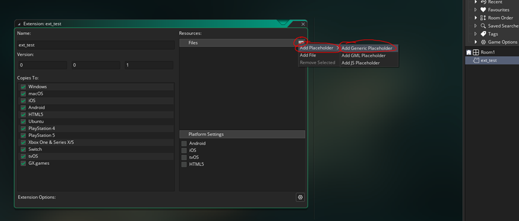

创建一个适用于Windows、Ubuntu（Linux）、Android、MacOS和iOS的GMS C++扩展 -> 使用Visual Studio和CMake

你好！

我的名字是Alex。

今天，我为大家带来一个非常完整的教程，该教程将详细解释如何从相同的C++源代码创建一个在以下平台上都能运行的扩展：

- Windows
- Ubuntu（Linux）
- Android
- MacOS
- iOS

这个指南将向你展示如何在所有这些平台上轻松处理字符串、双精度数（这是GMS扩展常见的数据类型）以及如何使用[缓冲区](https://manual.yoyogames.com/GameMaker_Language/GML_Reference/Buffers/Buffers.htm)！这个指南假设你正在使用Windows操作系统和Visual Studio Community 2022（或者任何其他Visual Studio许可证）。强烈建议你按照指南的顺序进行操作（直到开始讨论针对特定平台编译的部分），这样你就能理解所有基本原理以及为什么某些事情以某些特定的方式进行。

**注意：** 如果你有任何疑问或想提出建议，可以写评论，给我发论坛消息，或发邮件到[alejandroibrahimojea@gmail.com](mailto:alejandroibrahimojea@gmail.com)。

**注意 2：** 这个指南必须分为两个部分。第二部分可以在[这里](AGuidetoGenericC++Extensions2.md)找到。

## 一切的起源

基本上，我想制作一个类似Alchemy的游戏。问题是？在GMS中没有办法使用真实的SQL语法或使用任何类型的数据库引擎。

我的目标是使用一个轻量级的引擎，所以我把注意力放在了使用官方的SQLite3 C++源代码上。

经过一段时间，我逐渐发现了如何制作一个能够在所有提到的平台上使用SQLite3的C++扩展程序，它就像一个桥梁，让SQLite3在GMS中运行。

我所有工作的最终结果可以在[这个Itch.io链接](https://eternal-code-studio.itch.io/ecs-sqlite-3-for-gms)中找到，在那里你会找到我的扩展的最新版本，可以通过GMS使用真实的SQL语法和SQLite3数据库。

由于创建了这个扩展，我能够创建我的游戏Coniucta，可以在Google Play Store通过[这个链接](https://play.google.com/store/apps/details?id=com.ECS.Coniucta)获取。


## 设置Visual Studio以创建扩展

无论你要为哪个平台构建你的扩展，这些第一步都是一样的。

首先... 确保你的Windows操作系统上安装了Visual Studio Community 2022。你需要在Visual Studio Installer中确保安装了“使用C++进行桌面开发”包，因为这个包将允许我们创建一种称为CMake的项目类型。

CMake将允许我们从C++源代码编译出制作扩展所需的文件，以用于不同的平台。

一旦确保你已经安装了带有“使用C++进行桌面开发”包的Visual Studio Community，请打开VSC并创建一个新项目 > CMake。你应该看到下面的图片所示的内容：


然后设置项目名称和保存位置，并点击创建。 **重要提示:** 确保你的项目名称不要使用空格或特殊字符，因为这可能会在某些平台上导致编译错误。


设置完成后，你的项目将准备就绪。你可以删除预先创建的 .h 文件，因为我们不需要它：


在 CMakeLists.txt 文件中，你需要打开它并编辑包含你的 .h 文件的那一行(在这种情况下是 add_executable (TEST "TEST.cpp" "TEST.h") )，删除“Test.h”部分。

此外，你必须将 add_executable 更改为 add_library，因为我们将要编译的是创建一个库。你还必须添加 "SHARED" 部分，这样它就会创建正确的库类型。你的代码应该像这样：

add_library (TEST SHARED "TEST.cpp")

在你的 .cpp 文件中，你可以清除所有内容，并添加以下两个代码块。第一个代码块将允许你轻松地将你的 C++ 函数公开，以便被 GMS 调用和使用：

```cpp
#ifdef _WIN64
    #define GMS2EXPORT extern "C" __declspec(dllexport)
#else
    #define GMS2EXPORT extern "C"
#endif
```

接下来，你应该添加以下内容，这将允许你解释指向缓冲区的指针，这些缓冲区将由 GMS 作为字符串传递，以便在所有平台上都兼容：

```cpp
#include <cstring>
#include <string>
using namespace std;
char* getGMSBuffAddress(char* _GMSBuffPtrStr) {
    /*
        @description    将GMS缓冲区地址字符串转换为C++中可用的指针。
        @params         {char*} _GMSBuffPtrStr - GMS缓冲区的指针作为字符串。
        @return         {char*} 缓冲区的指针。现在像memcpy这样的函数将起作用。
    */
    size_t GMSBuffLongPointer = stoull(_GMSBuffPtrStr, NULL, 16);//将指针字符串转换为int64_t。
    return (char*)GMSBuffLongPointer;//将int64_t指针转换为char*并返回，以便可以在C++中操作缓冲区。
}
```

你完整的初始模板代码应该是这样的，才能开始工作：

```cpp
#ifdef _WIN64
    #define GMS2EXPORT extern "C" __declspec(dllexport)
#else
    #define GMS2EXPORT extern "C"
#endif
#include <cstring>
#include <string>
using namespace std;
char* getGMSBuffAddress(char* _GMSBuffPtrStr) {
    /*
        @description    将GMS缓冲区地址字符串转换为C++中可用的指针。
        @params         {char*} _GMSBuffPtrStr - GMS缓冲区的指针作为字符串。
        @return         {char*} 缓冲区的指针。现在像memcpy这样的函数将起作用。
    */
    size_t GMSBuffLongPointer = stoull(_GMSBuffPtrStr, NULL, 16);//将指针字符串转换为int64_t。
    return (char*)GMSBuffLongPointer;//将int64_t指针转换为char*并返回，以便可以在C++中操作缓冲区。
}
```


## 在GMS中设置扩展

我们的策略是创建一个使用通用占位符的扩展，这样你就不必从头编写所有可用的函数，只需编写一次即可。前往GMS，创建一个新的扩展，并添加一个通用占位符，如下所示：



通过这个简单的步骤，你就可以开始创建你自己的扩展了。

## 如何处理不同的数据类型

如前所述，GMS只能通过扩展与字符串和双精度数一起工作，这相当有限。然而，除了这两种数据类型外，你还可以提供指向内存位置的指针来处理缓冲区，但是有一个注意事项，当在GMS之外使用缓冲区时，无论使用何种类型的缓冲区，你都无法调整其大小或在其尺寸之外写入数据，因为这将导致严重的崩溃。

这部分将向你展示如何为所有平台定义字符串、双精度数以及如何传递缓冲区，但是对于Android和iOS，还有一些额外的步骤，将在"编译为..."中对这些特定平台进行解释。

所以让我们从你需要的初始信息开始...

当向扩展中添加新函数时，在GMS中的"External Name"必须与C++中的函数名匹配。

### 处理字符串

如果你想将字符串作为参数的一部分发送（并返回相同的字符串），在GMS中你必须这样定义：


然后在C++代码中，你可以创建一个以字符串作为参数的函数，如下所示：

```cpp
GMS2EXPORT char* ext_test_String(char* _myArgument0) {
    return (char*)_myArgument0;
}
```

之前的例子接受一个字符串作为参数，并将返回相同的字符串。

这个函数可以通过在GMS中进行以下操作来测试:

```gml
show_debug_message(ext_test_String("my sample string :D"));
```

应该显示一个带有传递参数的调试消息。

### 处理双精度数

如果你想要一个返回双精度数并接受双精度数作为参数的函数，GMS中的过程是相同的，你需要定义一个返回类型为双精度数，参数类型为双精度数的新函数。例如，在C++中，函数应该以以下方式定义：

```cpp
GMS2EXPORT double ext_test_Double(double _myArgument0) {
    return (double)_myArgument0;
}
```

这个函数将返回作为参数传递的双精度数。在GMS中调用它，你可以这样做：

```gml
show_debug_message(ext_test_Double(13));
```

这应该显示一个带有传递参数的调试消息。

### 处理缓冲区（更复杂的数据类型）

缓冲区基本上允许你存储除了字符串和双精度数之外的各种数据类型。

你可以在GMS中创建一个脚本，充当桥梁，负责所有创建缓冲区、将其传递给扩展，然后释放缓冲区以避免内存泄漏的过程。

为此，以下是一个完整的工作示例的基本示例。

在GMS扩展中，定义一个名为"ext_test_Buffer"的新函数，它返回一个双精度数（我们将使用双精度数来返回1，如果函数执行正常）并接受一个字符串类型的参数。

在GMS中创建一个脚本，并添加以下代码：

```gml
function f_bufferTestFromExt(){
    var _myBuff=buffer_create(2+4,buffer_fixed,1);//创建一个大小为6的缓冲区，它将允许我们存储一个无符号短整数（大小为2字节）和一个无符号整数（大小为4字节）
    var _myBuffAddress=string(buffer_get_address(_myBuff));//获取缓冲区的地址（作为字符串），它将被传递给扩展，以便它可以处理它
    var _response=ext_test_Buffer(_myBuffAddress);//调用扩展的函数并获取响应值（双精度数）
    show_debug_message("RESPONSE FROM : "+string(_response));//显示响应值的消息
    show_debug_message("SHORT INT VALUE: "+string(buffer_read(_myBuff,buffer_u16)));//显示第一个读取值（短整数）的调试消息
    show_debug_message("UNSIGNED INT VALUE: "+string(buffer_read(_myBuff,buffer_u32)));//显示第二个读取值（无符号整数）的调试消息
    buffer_delete(_myBuff);//删除缓冲区以避免内存泄漏
    return _response;//返回响应值
}
```

在C++代码中，你应该这样做：

```cpp
GMS2EXPORT double ext_test_Buffer(char* _GMSBuffPtrStr) {
    char* _GMSBuffer = getGMSBuffAddress(_GMSBuffPtrStr);//解释来自GMS的字符串地址，以便由C++管理
    //现在你可以执行memcpy操作（或任何其他内存操作）到缓冲区中 :)

    unsigned int currentWriteOffset = 0;//一个值，用于知道我们需要写入缓冲区的偏移量
    unsigned short int myUnShortInt = 65533;//将要写入缓冲区的无符号短整数值（然后在GMS中以调试消息显示）。
    unsigned int myUnInt = 4294967293;//将要写入缓冲区的无符号整数值（然后在GMS中以调试消息显示）。

    memcpy(&_GMSBuffer[currentWriteOffset], &myUnShortInt, sizeof(myUnShortInt));//写入无符号短整数
    currentWriteOffset += sizeof(myUnShortInt);//增加偏移量以将数据写入缓冲区的正确位置
    memcpy(&_GMSBuffer[currentWriteOffset], &myUnInt, sizeof(myUnInt));//写入无符号整数

    return 1;//返回1，表示一切正常 :)
}
```

如果现在在GMS中调用函数"f_bufferTestFromExt()"，你应该看到三个调试消息显示：

> RESPONSE FROM : 1

> SHORT INT VALUE: 65533

> UNSIGNED INT VALUE: 4294967293

**重要提示：** 请注意，GMS中的扩展函数只能有4个不同类型（字符串或双精度数）的参数。如果函数有超过4个参数，它们都需要是相同的类型。


### 创建一个非常好的并且文档良好的扩展

这是一个建议，可以让你创建一个非常好的、用户友好的扩展，以便最终用户能够更好地使用它：不要让他们直接与GMS中的扩展函数交互。
相反，将这些函数设置为“隐藏”，这样它们就不会显示为建议使用的函数，然后创建一个带有[JSDoc](https://manual.yoyogames.com/The_Asset_Editors/Code_Editor_Properties/JSDoc_Script_Comments.htm)文档的脚本。
下面是一个带有所有先前创建的3个函数的文档准备好的脚本：

```gml
#region f_testString
    /// @function                f_testString(_stringToReturn)
    /// @description             将提供的字符串发送到扩展。扩展然后会回复与提供的相同值。
    /// @param {String}             _stringToReturn   将发送到扩展并之后返回的值。
    /// @return {String}
    /// @self
    function f_testString(_stringToReturn){
        var _response=ext_test_String(_stringToReturn);//执行字符串测试
        show_debug_message("扩展的响应: "+_response);//显示响应值的消息
        return _response;//返回响应值
    }
#endregion
#region f_testDouble
    /// @function                f_testDouble(_doubleToReturn)
    /// @description             将提供的双精度数发送到扩展。扩展然后会回复与提供的相同值。
    /// @param {Real}             _doubleToReturn   将发送到扩展并之后返回的值。
    /// @return {Real}
    /// @self
    function f_testDouble(_doubleToReturn){
        var _response=ext_test_Double(_doubleToReturn);//执行双精度数测试
        show_debug_message("扩展的响应: "+string(_response));//显示响应值的消息
        return _response;//返回响应值
    }
#endregion
#region f_bufferTestFromExt
    /// @function                f_bufferTestFromExt()
    /// @description             发送一个预分配大小为6字节的空缓冲区。如果一切正常，将显示返回的值的调试消息，并返回值为1。
    /// @return {Real}
    /// @self
    function f_bufferTestFromExt(){
        var _myBuff=buffer_create(2+4,buffer_fixed,1);//创建一个大小为6的缓冲区，它将允许我们存储一个无符号短整数（大小为2字节）和一个无符号整数（大小为4字节）
        var _myBuffAddress=string(buffer_get_address(_myBuff));//获取缓冲区的地址（作为字符串），它将被传递给扩展，以便它可以处理它
        var _response=ext_test_Buffer(_myBuffAddress);//调用扩展的函数并获取响应值（双精度数）
        show_debug_message("扩展的响应: "+string(_response));//显示响应值的消息
        show_debug_message("短整数值: "+string(buffer_read(_myBuff,buffer_u16)));//显示第一个读取值（短整数）的调试消息
        show_debug_message("无符号整数值: "+string(buffer_read(_myBuff,buffer_u32)));//显示第二个读取值（无符号整数）的调试消息
        buffer_delete(_myBuff);//删除缓冲区以避免内存泄漏
        return _response;//返回响应值
    }
#endregion
```

使用这个脚本，你现在可以简单地调用这3个函数中的任何一个，并且Feather应该会显示一个提示，说明如何使用它们。


## 准备使用CMake

在Visual Studio中创建一个CMake项目时，会生成一个文件，称为"CMakePresets.json"。这个文件告诉CMake如何为不同的平台编译你的C++代码。默认情况下，这将是默认文件：

```json
{
    "version": 3,
    "configurePresets": [
        {
            "name": "windows-base",
            "hidden": true,
            "generator": "Ninja",
            "binaryDir": "${sourceDir}/out/build/${presetName}",
            "installDir": "${sourceDir}/out/install/${presetName}",
            "cacheVariables": {
                "CMAKE_C_COMPILER": "cl.exe",
                "CMAKE_CXX_COMPILER": "cl.exe"
            },
            "condition": {
                "type": "equals",
                "lhs": "${hostSystemName}",
                "rhs": "Windows"
            }
        },
        {
            "name": "x64-debug",
            "displayName": "x64 Debug",
            "inherits": "windows-base",
            "architecture": {
                "value": "x64",
                "strategy": "external"
            },
            "cacheVariables": {
                "CMAKE_BUILD_TYPE": "Debug"
            }
        },
        {
            "name": "x64-release",
            "displayName": "x64 Release",
            "inherits": "x64-debug",
            "cacheVariables": {
                "CMAKE_BUILD_TYPE": "Release"
            }
        },
        {
            "name": "x86-debug",
            "displayName": "x86 Debug",
            "inherits": "windows-base",
            "architecture": {
                "value": "x86",
                "strategy": "external"
            },
            "cacheVariables": {
                "CMAKE_BUILD_TYPE": "Debug"
            }
        },
        {
            "name": "x86-release",
            "displayName": "x86 Release",
            "inherits": "x86-debug",
            "cacheVariables": {
                "CMAKE_BUILD_TYPE": "Release"
            }
        },
        {
            "name": "linux-debug",
            "displayName": "Linux Debug",
            "generator": "Ninja",
            "binaryDir": "${sourceDir}/out/build/${presetName}",
            "installDir": "${sourceDir}/out/install/${presetName}",
            "cacheVariables": {
                "CMAKE_BUILD_TYPE": "Debug"
            },
            "condition": {
                "type": "equals",
                "lhs": "${hostSystemName}",
                "rhs": "Linux"
            },
            "vendor": {
                "microsoft.com/VisualStudioRemoteSettings/CMake/1.0": {
                    "sourceDir": "$env{HOME}/.vs/$ms{projectDirName}"
                }
            }
        },
        {
            "name": "macos-debug",
            "displayName": "macOS Debug",
            "generator": "Ninja",
            "binaryDir": "${sourceDir}/out/build/${presetName}",
            "installDir": "${sourceDir}/out/install/${presetName}",
            "cacheVariables": {
                "CMAKE_BUILD_TYPE": "Debug"
            },
            "condition": {
                "type": "equals",
                "lhs": "${hostSystemName}",
                "rhs": "Darwin"
            },
            "vendor": {
                "microsoft.com/VisualStudioRemoteSettings/CMake/1.0": {
                    "sourceDir": "$env{HOME}/.vs/$ms{projectDirName}"
                }
            }
        }
    ]
}
```

如你可能已经猜到的那样，它提供了编译到Windows（在调试和发布模式下的x86和x64架构）、Linux和MacOS的定义，但是，我们将更改此文件以适应我们的需求。首先，清除配置预设数组中的所有内容。在为每个平台添加预设和设置之前，我会告诉你要做什么。在开始为特定平台添加支持之前，你的最终文件应该是这样的：

```json
{
    "version": 3,
    "configurePresets": [

    ]
}
```


***-------------------从此处开始，搜索你想为之创建扩展的特定平台-------------------\*


Compiling for Windows**
Compiling for Windows is very straight forward... we are on Windows... we don't have to do any special stuff.
On Windows, your C++ code should be compiled to .DLL (Dynamic Link Library).
This is what GMS needs to work with a C++ extension on Windows.
GMS (its latest version) only support x64 Windows executables, so it only makes sense to create a .DLL that is compatible for x64. To do so, head over to VS and open up the "CMakePresets.json". In there you will have to add a new entry to the "configurePresets". The following code shows an example of how it should look like (assuming that you have no other presets):

JSON:

```json
{
  "version": 3,
  "configurePresets": [
    //WINDOWS x64 release preset
    {
      "name": "x64-release",
      "displayName": "x64 Release",
      "generator": "Ninja",
      "binaryDir": "${sourceDir}/out/build/${presetName}",
      "installDir": "${sourceDir}/out/install/${presetName}",
      "cacheVariables": {
        "CMAKE_C_COMPILER": "cl.exe",
        "CMAKE_CXX_COMPILER": "cl.exe"
      },
      "condition": {
        "type": "equals",
        "lhs": "${hostSystemName}",
        "rhs": "Windows"
      },
      "architecture": {
        "value": "x64",
        "strategy": "external"
      }
    }
  ]
}
```

If you now click on save, you should see in the upper part of VS that from the two dropdowns you can select "Local Machine" and "x64 Release". Once you have selected those 2 options in the dropdown, go to Build > Build All. This will start to compile your C++ code. If everything went OK (you don't have erros in your code, your tools are OK, etc...) you should see a message like: "Build All succeeded."

If this was the message that you recevied, you will have available in your VS project directory, in the "out\build\x64-release\{YOURPROJECTNAME}" (for this example the path is C:\Users\aleja\Desktop\TEST\out\build\x64-release\TEST) you will find a group of files, where amongst them, you will find a .DLL file.
That .DLL is the library ready to be provided to GMS. Head over to GMS, add in the extension the .DLL in the proxy files ([here ](https://manual.yoyogames.com/index.htm#t=The_Asset_Editors%2FExtension_Creation%2FCreating_An_Extension.htm)you will find how to do that), mark the checkbox in the extension the "Windows" platform so that it is included, and execute your game.
If everything was done OK, you should now be able to call the three functions with no issues from your Windows GMS executable 
Congratulations, your extension should now be working for Windows 


**Compiling for Ubuntu (Linux)**
To compile for Ubuntu you will need to have a physical computer with Ubuntu or a Virtual Machine (I use VirtualBox).
You will then have to configure your machine following the steps described in[ this GMS article](https://help.yoyogames.com/hc/en-us/articles/235186168-Setting-Up-For-Ubuntu).
Adittionally, after finshing all the setup from that article you will have to add 2 additional libraries as described in [this GMS article](https://help.yoyogames.com/hc/en-us/articles/360024186531).
We are doing all this because this will allow you to test your extension once its created.
Finally, you will have to install in your Ubuntu machine "CMake" and "Ninja" (in the default paths). There are lots of articles on-line if you Google on how to install this.

Additionally, on VS hou will have to setup the connection with the Ubuntu machine (or virtual machine). In the upper part of VS, if you select from the two dropdowns the one that is most to the left (normally it should have the value of "Local machine") you will see an option in the dropdown that says "Manage connections". Click on "Add" and then add all the information to connect to your Ubuntu machine (or virtual machine). Now, if the connection was successful, in the dropdown you should see the IP that you configured as an available option to be selected.

On Ubuntu, your C++ code should be compiled to .SO (Shared Objects).
This is what GMS needs to work with a C++ extension on Ubuntu.
GMS (its latest version) only support x64 executables, so it only makes sense to create a .SO that is compatible for x64. To do so, head over to VS and open up the "CMakePresets.json". In there you will have to add a new entry to the "configurePresets". The following code shows an example of how it should look like (assuming that you have no other presets):

JSON:

```json
{
  "version": 3,
  "configurePresets": [
    //LINUX x64 release preset
    {
      "name": "linux-release",
      "displayName": "Linux Release",
      "generator": "Ninja",
      "binaryDir": "${sourceDir}/out/build/${presetName}",
      "installDir": "${sourceDir}/out/install/${presetName}",
      "condition": {
        "type": "equals",
        "lhs": "${hostSystemName}",
        "rhs": "Linux"
      }
    }
  ]
}
```

If you now click on save, you should see in the upper part of VS that from the two dropdowns you can select "YOUR UBUNTU MACHINE OR VIRTUAL MAHCINE IP" and "Linux Release". Once you have selected those 2 options in the dropdown, go to Build > Build All. This will start to compile your C++ code. If everything went OK (you don't have erros in your code, your tools are OK, etc...) you should see a message like: "Build All succeeded."

If this was the message that you recevied, you will have available in your remote machine, in the "/home/{YOURUSERNAME}/.vs/{YOURPROJECTNAME}/out/build/linux-release/{YOURPROJECTNAME}" (for this example the path is /home/alex/.vs/TEST/out/build/linux-release/TEST) you will find a group of files, where amongst them, you will find a .SO file that you will have to send back to your Windows machine.

That .SO is the library ready to be provided to GMS. Head over to GMS, add in the extension the .SO in the proxy files ([here ](https://manual.yoyogames.com/index.htm#t=The_Asset_Editors%2FExtension_Creation%2FCreating_An_Extension.htm)you will find how to do that), mark the checkbox in the extension the "Ubuntu" platform so that it is included, and execute your game.
If everything was done OK, you should now be able to call the three functions with no issues from your Ubuntu GMS executable 
Congratulations, your extension should now be working for Ubuntu 


**Compiling for Android**
To compile for Android you will first have to follow [this GMS article](https://help.yoyogames.com/hc/en-us/articles/115001368727-Setting-Up-For-Android) that explains you how to setup GMS for Android. This will be usefull for us since we need the NDK which is included in Android Studio. Also, it will be useful to have the Android emulators to test your Android extension before distributing it.
Once you have Android Studio setup. there are some changes that must be done. Android is a "special" platform, since it won't be able to directly communicate with your C++ code. Instead, you will need to use something called JNI (Java Native Interface) that will act as a bridge between Java and C++, and it will require a little bit more of work by your side.
On Android, you need to create from VS a .SO (Shared Object) library that works for x86_64, arm64-v8a and armeabi-v7a architectures, since these are all the architectures that GMS support for Android.


Changes to be done in VS


Go to VS and open up the "CMakePresets.json". In there you will have to add a new entry to the "configurePresets". The following code shows an example of how it should look like (assuming that you have no other presets):

JSON:

```json
{
  "version": 3,
  "configurePresets": [
    //Android common configuration (Used by all Android architecutres and hidden in the dropdown of VS)
    {
      "name": "android-common",
      "hidden": true,
      "generator": "Ninja",
      "binaryDir": "${sourceDir}/out/build/android/${presetName}",
      "installDir": "${sourceDir}/out/install/android/${presetName}",
      "toolchainFile": "C:/Android/SDK/ndk/25.2.9519653/build/cmake/android.toolchain.cmake", //The NDK android.toolchain.cmake
      "condition": {
        "type": "equals",
        "lhs": "${hostSystemName}",
        "rhs": "Windows"
      },
      "cacheVariables": {
        "ANDROID_PLATFORM": "19" //Minimun API supported
      }
    },
    //Android x86_64
    {
      "name": "x86_64",
      "displayName": "Android x86_64 Release",
      "inherits": "android-common",
      "cacheVariables": {
        "ANDROID_ABI": "x86_64"
      }
    },
    //Android arm64-v8a
    {
      "name": "arm64-v8a",
      "displayName": "Android arm64-v8a Release",
      "inherits": "android-common",
      "cacheVariables": {
        "ANDROID_ABI": "arm64-v8a"
      }
    },
    //Android armeabi-v7a
    {
      "name": "armeabi-v7a",
      "displayName": "Android armeabi-v7a Release",
      "inherits": "android-common",
      "cacheVariables": {
        "ANDROID_ABI": "armeabi-v7a"
      }
    }
  ]
}
```

**NOTE:** There are two lines in the previous code which you will have to adapt to your case so pay special attention to them. One of them is "toolchainFile", where you will have to specifiy the path to the NDK android.toolchain.cmake (this should be installed with Android Studio if you followed the GMS guide). Also, "ANDROID_PLATFORM" is of your interest, since it indicates the minimun supported API level for your extension. As of NDK 25.2.9519653 the minimun allowed API version is 19, and trying to build for something lower than that will result in failure when compiling the needed libraries.

Once you've done that, we still have to do two things in VS: Create you JNI bridge with Java file and change the compile options for the Android option.

In VS go to the folder where you have (assuming its called the same as in the example) the TEST.cpp source code, and create in that same folder a file named something like "native-lib.cpp". This file will contain the JNi definition needed to interop with your game on Android.
Here is the code that you have to insert for your extension to work with the 3 demo functions that we are using.

C++:

```cpp
#include <jni.h>
#include <string>
#include "TEST.cpp"
extern "C" {
    JNIEXPORT jstring JNICALL Java_com_ACOMPANY_APROJECT_MainActivity_JNIexttestString(JNIEnv* env, jclass cl, jstring _myArgument0) {
        char* _myArgument0_nativeString = (char*)env->GetStringUTFChars(_myArgument0, 0);//Convert the passed jstring to a native string
        jstring _myResponse = env->NewStringUTF(ext_test_String(_myArgument0_nativeString));//Call the function and store its value in _myResponse
        env->ReleaseStringUTFChars(_myArgument0, _myArgument0_nativeString);//Release the native string from memory to avoid memory leaks
        return (jstring)_myResponse;//Return the response
    }
    JNIEXPORT jdouble JNICALL Java_com_ACOMPANY_APROJECT_MainActivity_JNIexttestDouble(JNIEnv* env, jclass cl, jdouble _myArgument0) {
        return (jdouble)ext_test_Double(_myArgument0);//Call the extension function and return its value
    }
    JNIEXPORT jdouble JNICALL Java_com_ACOMPANY_APROJECT_MainActivity_JNIexttestBuffer(JNIEnv* env, jclass cl, jstring _GMSBuffPtrStr) {
        char* _GMSBuffPtrStr_nativeString = (char*)env->GetStringUTFChars(_GMSBuffPtrStr, 0);//Convert the passed jstring to a native string
        jdouble _myResponse = ext_test_Buffer(_GMSBuffPtrStr_nativeString);//Call the function and store its value in _myResponse
        env->ReleaseStringUTFChars(_GMSBuffPtrStr, _GMSBuffPtrStr_nativeString);//Release the native string from memory to avoid memory leaks
        return (jdouble)_myResponse;//Return the response
    }
}
```

**NOTE:** While writing the previous code, VS will complain that your code is wrong, but don't worry, its because it doesn't know about jni.h and all the things related to Java. Remember also after the function JNI you must not use "_" or it will give you issues.

As you might have already seen from the previous code, doubles are treated as jdouble and strings as jstring. Working with strings is a bit tricky beacuse you will have to use GetStringUTFChars and then release them using ReleaseStringUTFChars. If you don't release them, you will get memory leaks eventually crashing your game.

The functions in JNI must be named using the following syntax:
JNIEXPORT {RETURNTYPE} JNICALL Java_com_ACOMPANY_APROJECT_MainActivity_JNI{FUNCTION_NAME}(JNIEnv* env, jclass cl)
Where:

- {RETURNTYPE} can be either jdouble or jstring.
- {FUNCTION_NAME} should be the name of the function in your C++ code to make it easier to find it afterwards (**WITHOUT "_" OR YOU WILL HAVE ISSUES AFTERWARDS)**.

As you've seen you will always have to include the "JNIEnv* env" and "jclass cl" as arguments since these are required. All the arguments that you wish to pass, should be added after the "jclass cl" argument.

For the last step, in VS in the same folder where your natice-lib.cpp and TEST.cpp files are, go to "CMakeLists.txt", and you will have to change the information to the following (assuming your project is named TEST and your source C++ file is TEST.cpp)

Code:

```
# Add source to this project's executable.
if(ANDROID)
    message("Building for Android")
    add_library(TEST SHARED "native-lib.cpp")
else()
    message("Not building for Android")
    add_library (TEST SHARED "TEST.cpp" )
endif()

if (CMAKE_VERSION VERSION_GREATER 3.12)
  set_property(TARGET TEST PROPERTY CXX_STANDARD 20)
endif()
```

What this will do is that when compiling for Android, it will compile using as source the "native-lib.cpp", and when not compiling for Android, it will use "TEST.cpp".

If you now click on save, you should see in the upper part of VS that from the two dropdowns you can select "Local Machine" and "Android x86_64 Release" / "Android arm64-v8a Release" / "Android armeabi-v7a Release". Once you have selected those 2 options in the dropdown, go to Build > Build All. This will start to compile your C++ code. If everything went OK (you don't have erros in your code, your tools are OK, etc...) you should see a message like: "Build All succeeded."
You will have to repeat this process for these 3 build options:

- "Local Machine" and "Android x86_64 Release"
- "Local Machine" and "Android arm64-v8a Release"
- "Local Machine" and "Android armeabi-v7a Release"

Once you have build for all the Android architectures and your builds have all succeded, you will be interested in the .SO file generated for each architecture. They will be located here (asumming your project is called TEST and its located in "C:\Users\aleja\Desktop\TEST")

- C:\Users\aleja\Desktop\TEST\out\build\android\x86_64\TEST\libTEST.so
- C:\Users\aleja\Desktop\TEST\out\build\android\arm64-v8a\TEST\libTEST.so
- C:\Users\aleja\Desktop\TEST\out\build\android\armeabi-v7a\TEST\libTEST.so


Preparing the lib.jar


The lib.jar is needed by Android. To prepare it follow these steps.
Outside of your project, anywhere on your computer, create a folder named "lib". Inside that folder create three folder named exactly like this (asumming your project is called TEST and its located in "C:\Users\aleja\Desktop\TEST"):

- x86_64 --> Copy inside this folder the C:\Users\aleja\Desktop\TEST\out\build\android\x86_64\TEST\libTEST.so file
- arm64-v8a --> Copy inside this folder the C:\Users\aleja\Desktop\TEST\out\build\android\arm64-v8a\TEST\libTEST.so file
- armeabi-v7a --> Copy inside this folder the C:\Users\aleja\Desktop\TEST\out\build\android\x86_64\TEST\armeabi-v7a\TEST\libTEST.so file

**NOTE:** You can create the extension for the three Android architectures, however, if you or your final user don't want to build your final Android executable for an specific architecture, you MUST delete the architecture folder that you don't want to build for (for example, if your game won't be avialble for armeabi-v7a, delete the armeabi-v7a folder). If you fail to this and create the .zip and .jar file in the following steps with these folders, when submiting to Google Play it will assume that your game includes that specific architecture that you haven't build for in GMS, making your game available for those devices which will probably make you to get bad reviews since your game won't be able to start on those devices.

Now, get the lib folder and compress it to .zip file (including the lib folder). After you have done that, rename your lib.zip to lib.jar.
With this, you will now have your lib.jar ready that is needed by GMS.


Preparing the GMS extension structure for Android and adding the lib.jar


GMS uses an specific folder structure inside the extension when working with extensions on Android.
Open your project in GMS and make sure you have marked the "Copies to" to the "Android" platform in both the extension itself and the extension properties. In the extension then mark the checkbox of "Android" under "Platform settings", which will show up a new window.
In the "Class name" textbox put "class_testExt" and save your project.

In the Windows File explorer go to your GMS project. You will find in it a folder named "extensions". Inside the "extensions" folder you should find a folder that matches the exact name of the extension that you created in GMS. If you go in it you must create a folder named "AndroidSource". Assuming your GMS is located in "C:\Users\aleja\Desktop\GMS_ExtTutorial" and your extension name is "ext_test", your newly created folder path should be this: "C:\Users\aleja\Desktop\GMS_ExtTutorial\extensions\ext_test\AndroidSource"
Inside the "AndroidSource" folder, create tow folders: "Java" and "libs".
Inside the "libs" folder, copy the lib.jar that you created previously.

With all these steps, you would have setup the GMS extension structure for Android. 


Writing the Java code


One last step that we are missing is to write the Java code that will be used by GMS for being able to call the contents in lib.jar and use it.
From all the previously created folders inside your extension, head over to the "AndroidSource\Java\" one, and inside it, create two new files named: "MainActivity.java" and "class_testExt.java".
I recommend you for this part using a text editor like notepad++ to open these two Java files that you will have to edit.
Here is the code that you should be using for "MainActivity.java" to work with the three demo functions

Java:

```java
package com.ACOMPANY.APROJECT;
public class MainActivity{
    public static native String JNIexttestString(String _myArgument0);
    public static native double JNIexttestDouble(double _myArgument0);
    public static native double JNIexttestBuffer(String _GMSBuffPtrStr);
    static {
        System.loadLibrary("TEST");
    }
}
```

Here is the code that you should be using for "class_testExt.java" to work with the three demo functions

Java:

```java
package ${YYAndroidPackageName};
import ${YYAndroidPackageName}.R;
import com.yoyogames.runner.RunnerJNILib;

import java.lang.String;

import static com.ACOMPANY.APROJECT.MainActivity.*;
public class class_testExt{
    public String ext_test_String(String _myArgument0){
        return JNIexttestString(_myArgument0);
    }
    public double ext_test_Double(double _myArgument0){
        return JNIexttestDouble(_myArgument0);
    }
    public double ext_test_Buffer(String _GMSBuffPtrStr){
        return JNIexttestBuffer(_GMSBuffPtrStr);
    }
}
```

**NOTE:** From the previous Java code, the name of the file must much the public class name, so if the public class is "class_testExt", the file name must be "class_testExt.java".

If everything was done OK, you should now be able to call the three functions with no issues from your Android GMS executable 
Congratulations, your extension should now be working for Android 
**NOTE:** I recommend you to use the Android Studio emulator to test your extension before distributing your game.


**FOR MacOS and iOS**
This post was too long, so I divided it into another post.
The part for MacOS and iOS can be found [here](https://forum.gamemaker.io/index.php?threads/guide-create-a-c-extension-for-gms-that-works-for-windows-ubuntu-linux-android-macos-and-ios-part-2-uses-visual-studio-and-cmake.102978/).