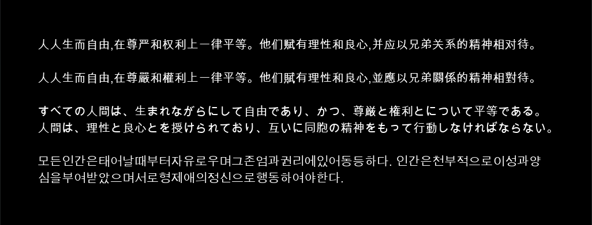
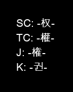
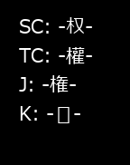
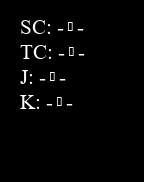

本文记录了在 GameMaker Studio 2 中使用中文、日文或韩文（CJK）进行字体设置和文本绘制的最佳实践。

## 中日韩文字有何不同？

- **您不能使用西方受众熟悉的大多数字体。** 这包括许多常见的基线字体，如 Arial、Courier New、Times New Roman 等，以及大多数未明确为中日韩设计的装饰性和艺术性字体。
- **你不能只是 “添加字母表”。** 中日韩语言以其庞大的字符集而闻名，字符集的字形多达数千个。如果试图将它们的全部字符都包含在纹理中，将会占用极大的空间，轻则导致纹理交换次数过多，重则导致超出 VRAM 错误。

## 我应该使用 `font_add` 还是 字体资源?

对所有 `开放式文本` 使用 `font_add` 添加字体。开放式文本意味着在绘制用户输入或大容量文本（如游戏对话）时，您无法轻易确定将涉及多少或哪些字符。

仅在 `封闭式文本` 中使用基于表面的字体（即 IDE 中用于 “添加” 字符范围的字体资源，或 `font_add_sprite`）。这意味着要在视觉效果和固定 UI 元素等地方绘制文本，在这些地方使用的确切字符是预先知道的，范围相对较小，并且不会在运行时扩展。

很多时候，您会混合使用这两种字体，例如，使用更高级的基于表面的字体来绘制特效（封闭式文本），而使用 `font_add` 字体来绘制用户界面中的用户名（开放式文本）。

**警告：** **从来不要依赖 "默认" 字体 (例如 `draw_set_font(-1);` 或者从不调用 `draw_set_font`).** 它只包含最基本的 ASCII 字符，除此之外不会绘制任何其他字符。它也不适用于 HTML5。

## 为中日韩字体使用 `font_add`

为了在GMS 2中为非 HTML5 导出设置CJK字体，首先将字体的TTF文件添加到“包含的文件”中，然后使用 `font_add` 加载它。**你应该在游戏开始时只执行一次这个操作。**

```gml
global.fnt_cjk = font_add(working_directory + "ARIALUNI.TTF", 16, false, false, 32, 127);
```

在绘制CJK文本时，使用 `draw_set_font` 来设置之前加载的字体，然后绘制文本。

```gml
draw_set_font(global.fnt_cjk);
draw_text(x, y, "人人生而自由,在尊嚴和權利上一律平等。他们賦有理性和良心,並應以兄弟關係的精神相對待。");
```

**注意：** 不必担心 `font_add` 中的最后两个参数（`first` 和 `last`）。这些不是硬性限制，当绘制时会根据需要获取标准ASCII范围之外所需的CJK字形。

一个扩展的示例涵盖了所有4种CJK脚本类型，可以在[这里](https://www.dropbox.com/s/57oq3ltb61oguh4/cjk_test.yyz?dl=1)找到。文本应该按以下方式呈现：



**选择字体**

CJK字体通常分为4种脚本类别：

- 简体中文（用于中国大陆及海外华人）
- 繁体中文（用于香港、澳门、台湾及海外华人）
- 日文
- 韩文

您选择的字体将取决于产品的目标受众。如果您不懂目标语言，请咨询翻译员、本地设计师或母语者的建议。对于不熟悉的人来说，不正确的设置可能会误以为是有效的设置。完成后不要就此认为任务完成了！

基准字体

以下是我认为每种脚本类型的基准字体的简要表格。更全面的基本字体列表，请参阅[Wikipedia的CJK字体列表](https://en.wikipedia.org/wiki/List_of_CJK_fonts)。


| 通用字体                                                    | 简体中文字体                                                | 繁体中文字体                                                  | 日文字体                                      | 韩文字体                                                       |
| ------------------------------------------------------------ | --------------------------------------------------------- | ------------------------------------------------------------ | ---------------------------------------------- | ------------------------------------------------------------ |
| Arial Unicode (Sans-Serif)Noto Sans CJK (Sans-Serif)Noto Serif CJK (Serif) | SimKai (Serif)SimSun / NSimSun (Serif)SimHei (Sans-Serif) | DFKai-SB (Serif)MingLiU / PMingLiu (Serif)JhengHei (Sans-Serif) | MS Mincho / PMincho (Serif)Meiryo (Sans-Serif) | Batang / BatangChe (Serif)Dotum / DotumChe (Sans-Serif)Gulim / GulimChe (Sans-Serif)Gungsuh / GungsuhChe (Serif) |


## 测试字体的字形

使用设计错误的字体可能会导致您的文本中出现意外的空白或占位符。特别是艺术和装饰性字体通常对CJK的覆盖范围有限，甚至没有覆盖。

要确定字体是否支持给定的脚本类别，您可以检查每种脚本类型中都不同的“权威”字符：


| 简体中文         | 繁体中文            | 日文     | 韩文    |
| ------------------ | ------------------- | -------- | ------ |
| 权                 | 權                  | 権       | 권     |


**警告：不要通过在文本编辑器中设置字体或使用GMS 2中的字体预览来测试字体是否与语言兼容。** 当字体缺少给定语言的字形时，许多文本编辑器和本地文本字段会自动从具有这些字形的其他默认字体中提取字形。这会导致即使字体实际上不支持，也会产生支持的虚假幻觉。

### 方法1：快速酸性测试

设置字体和颜色，然后绘制包含每个测试字符的字符串：

```gml
draw_text(x, y, "SC: -权-\nTC: -權-\nJ: -権-\nK: -권-");
```

正面的结果将在短横线之间包含正确的字符。负面的结果将导致一行显示 `--`（两个短横线）或 `-▯-`（两个短横线之间有占位符）。







左图：Arial Unicode 在所有4种CJK脚本类型上显示正面结果。
中图：Meiryo 只在韩文上显示负面结果。
右图：Times New Roman 在所有CJK脚本类型上都显示负面结果。

你可以在这里下载一个包含上述内容的现成测试项目：

- [带有字体资源的测试项目](https://www.dropbox.com/s/tz5cp436dtutu7a/cjk_acid_test_surface.yyz?dl=1)（选择 `fnt_text` 并使用 **选择字体** 下拉菜单选择您的字体）
- [带有 `font_add` 的测试项目](https://www.dropbox.com/s/020x5esq1u2d2cm/cjk_acid_test_fontadd.yyz?dl=1)（在 **包含的文件** 中用您的字体的TTF文件覆盖 `font.ttf`）


### 方法2：使用系统工具

#### Windows：字符映射

从开始菜单打开 **字符映射** 并选择要测试的字体。然后搜索以下字符点的存在：

- 简体中文：U+6743 (26435)
- 繁体中文：U+6B0A (27402)
- 日文：U+6A29 (27177)
- 韩文：U+AD8C (44428)


#### Mac：字体册

从启动台打开 **字体册** 并选择要测试的字体。切换到具有AI的自定义预览模式，并复制粘贴以下测试字符：

- 简体中文：权
- 繁体中文：權
- 日文：権
- 韩文：권