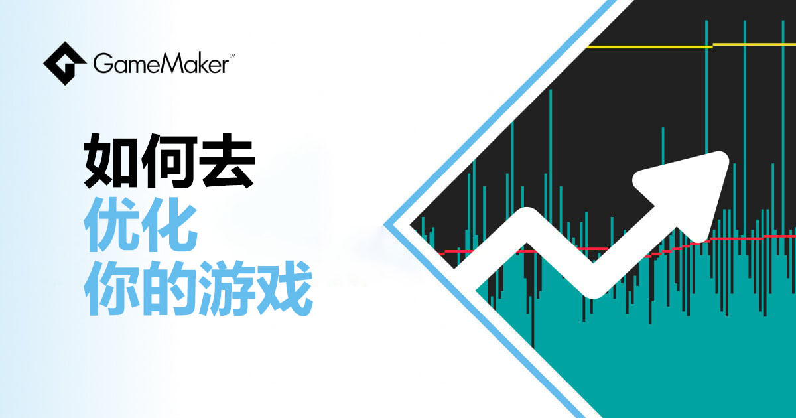
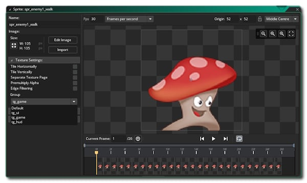

在使用 GameMaker 制作游戏的过程中，最常被问到的就是：如何优化游戏，并使其尽可能高效地运行。

虽然没有适用于所有项目的简单答案，但在所有项目中都可以遵循一些通用的 “经验法则”，这将有助于您最大限度地利用 GameMaker。

## 图形

图形管道是造成游戏运行缓慢和卡顿的最常见原因之一，因此您需要确保以最高效的方式绘制所有内容。下面是一些实现这一目标的技巧。

### 纹理页

GameMaker 将所有游戏图形存储在 **纹理页** 上。纹理页是一整张图像，所有游戏图形都分布在其中，运行时可以从中 “提取” 出来图形在屏幕上绘制。

现在，当您为游戏创建了许多图形时，它们可能会开始占用一个以上的纹理页，这会导致它们分散到多个不同的纹理页上。GameMaker 在屏幕上绘制这些图形时，可能需要执行 **纹理交换** ，以便从正确的页面获取正确的精灵，这在只有几页的情况下问题不大，但当这些图形分散在许多页面上时，这种连续的交换可能会导致延迟和卡顿。

如何避免这种情况？您可以为游戏创建 **纹理组** ，然后在房间开始时从纹理内存中刷新和预取未使用的图形，这意味着内存中只保留了实际要使用的图形。

首先，您应该从 IDE 顶部的 **工具** 菜单中打开 **纹理组编辑器**。在这里，您可以创建所需的纹理组 —— 例如，如果您有一些只出现在主菜单中的图形，那么就为它们创建一个组。如果您有一系列只在单个关卡/房间中出现的图形（包括精灵和背景），就为它们创建一个组，等等。


有了组之后，就可以使用 “*添加资产*” 按钮查看精灵和背景，并将每个精灵和背景分配到一个特定的组中，也可以查看每个精灵，然后从资产窗口中的 **组** 下拉菜单中设置纹理组：



这样，您就已经对游戏进行了相当程度的优化，因为这将限制所需的纹理交换，特定房间的所有图形现在都应该在同一页面上。

至于从内存中清除不需要的页面，您可以在每个房间的第一个实例的 **创建事件** 中（可在房间编辑器中设置）使用函数来完成：

```gml
draw_texture_flush();
```

此函数将清除纹理内存中的所有图像数据。请注意，这可能会导致在运行绘制事件（Draw Event）时首次加载新纹理时出现短暂的闪烁，因此为了避免这种情况，您还应在同一事件中 “初始化” 纹理，只需调用一个 [预获取函数](/tool/manual.html?path=GameMaker_Language/GML_Reference/Asset_Management/Sprites/Sprite_Manipulation/sprite_prefetch.htm?rhsearch%3Dpre%20fetch%26rhhlterm%3Dpre%20fetch)（每个所需页面一个）即可。由于这是在创建事件中进行的，所以不会被人看到，但可以防止在实际绘制游戏图形时出现任何闪烁。最终的创建事件将如下所示：

```gml
draw_texture_flush();
sprite_prefetch(spr_logo);
sprite_prefetch(spr_menu);
```

请记住 *您只需为每个纹理页预取一个图形！* 您可以在每个平台的 **游戏选项** 中查看如何将精灵打包到每个纹理页上。


通过点击游戏选项中 **图形** 部分的 “*预览*” 按钮，您可以看到完成后的纹理页面的外观。这样，您就可以看到所有图像是在一个页面上还是在多个页面上，并决定如何创建和分配组和页面。


### 动态纹理

您还可以将纹理组标记为 [动态](/tool/manual.html?path=Settings/Texture_Information/Dynamic_Textures.htm) 。虽然可以预取和刷新纹理组，以便从显存（VRAM）中加载和卸载纹理组，但它们仍保存在 RAM 中。动态纹理组可以将纹理组保存在磁盘上，只有在需要时才将其加载到 RAM（随后加载到 VRAM）中。加载动态纹理组的方法是使用函数：

```gml
texturegroup_load(groupname, [prefetch=true])
```

卸载是通过以下函数完成的：

```gml
texturegroup_unload(groupname)
```

### 运行时添加资产

在 GameMaker 中可以从外部载入精灵，也可以使用 [sprite_add()](/tool/manual.html?path=GameMaker_Language/GML_Reference/Asset_Management/Sprites/Sprite_Manipulation/sprite_add.htm) 等函数创建新资产。不过，以这种方式创建的每个新资产都会 **创建一个新的纹理页** ，这意味着（例如）添加 10 个新的精灵将创建 10 个*新的纹理页*！而每次绘制这些精灵时，都会进行一次新的纹理交换，并中断显卡的批处理。

可以想象，这样做的效率并不高，因此（与以前版本的 GameMaker 不同）应避免这样做，而应在 IDE 中将所有图形资产添加到游戏捆绑包中。请注意，您可以使用这些函数来添加/创建少量图片，它们不会对性能产生负面影响，但应避免以这种方式添加大量图片，因为这将会产生影响。

**注意：** 函数 [*sprite_add()*](/tool/manual.html?path=GameMaker_Language/GML_Reference/Asset_Management/Sprites/Sprite_Manipulation/sprite_add.htm) *在精灵加载完成之前，该函数会阻止代码的进一步执行。您可以使用* [*sprite_add_ext()*](/tool/manual.html?path=GameMaker_Language/GML_Reference/Asset_Management/Sprites/Sprite_Manipulation/sprite_add_ext.htm) 以异步方式加载精灵。

## 绘制优化

### 深度缓冲区

深度缓冲区存储了表面上每个像素的深度值（或 Z 值），也就是像素到摄像机的距离。默认情况下，创建的所有表面都有一个深度缓冲区。每当在表面上绘制新内容时，深度值都会在启用 Z 写入（默认会启用）后被写入深度缓冲区：

```gml
gpu_set_zwriteenable(true);
```

不过，如果游戏允许，您可以在处理表面时使用 [surface_depth_disable](/tool/manual.html?path=GameMaker_Language/GML_Reference/Drawing/Surfaces/surface_depth_disable.htm) 禁用深度缓冲区，然后让绘制顺序来处理一切。禁用深度缓冲区后，创建的曲面将不会带有深度缓冲区。要禁用深度缓冲区，请在创建表面前调用以下命令：

```gml
surface_depth_disable(true);
```

禁用深度缓冲区时，也无需在像素之间进行深度比较，也无需写入任何深度信息：

```gml
gpu_set_zwriteenable(false);
gpu_set_ztestenable(false);
```

毕竟，所有东西都是前后绘制的，所以后面绘制的任何东西都是在前面绘制的基础上绘制的。

### 混合模式

绘制时，GameMaker 会通过图形管道发送 “批” 图形数据进行绘制，显然您希望尽可能减少这一操作的频率。通常情况下您不需要担心这个问题，但如果您使用 [混合模式](/tool/manual.html?path=GameMaker_Language/GML_Reference/Drawing/GPU_Control/gpu_set_blendmode_ext.htm?rhsearch%3Dblend%20mode%26rhhlterm%3Dblend%20mode) 进行绘制，那么每次调用设置混合模式都会破坏当前的纹理批次，而多个实例的多次调用可能会对您的游戏产生不利影响。

如何解决这个问题？尝试只使用一个实例来设置混合模式，然后绘制所有需要的内容。例如：

```gml
gpu_set_blendmode(bm_add);
with (obj_HUD) draw_sprite(spr_Marker, 0, mx, my);
with (obj_Player) draw_sprite(spr_HaloEffect, 0, x, y);
with (obj_Cursor) draw_self();
gpu_set_blendmode(bm_normal);
```

这将为单个批处理调用设置混合模式，而不是为每个引用实例设置三个单独的混合模式。

**注意：** *其他可能导致批处理失败的情况包括绘制形状、使用绘制健康条功能、使用着色器、设置uniforms和更改渲染目标。*


### Alpha 混合和 Alpha 测试

GameMaker 中有两个绘制功能经常被忽视，但它们都能大大加快绘制过程。它们是：

- [gpu_set_alphatestenable()](/tool/manual.html?path=GameMaker_Language/GML_Reference/Drawing/GPU_Control/gpu_get_alphatestenable.htm?rhsearch%3Dalphatest%26rhhlterm%3Dalphatest)
- [gpu_set_blendenable()](/tool/manual.html?path=GameMaker_Language/GML_Reference/Drawing/GPU_Control/gpu_get_blendenable.htm?rhsearch%3Dblend%20enable%26rhhlterm%3Dblend%20enable)

这些功能有什么帮助呢？第一种方法可以启用 **Alpha 测试**，基本上是检查每个像素的 Alpha 值，如果它高于混合阈值（0 到 255 之间的一个值），就会被绘制出来。从本质上讲，这将 “丢弃” 任何 Alpha 值低于测试值的像素，也就是说永远不会绘制它（因为即使 Alpha 值为零的像素也会正常 “绘制”），这也是加快没有 Alpha 梯度的复古像素艺术图形游戏速度的绝佳方法。请注意，您可以使用函数 [gpu_set_alphatestref()](/tool/manual.html?path=GameMaker_Language/GML_Reference/Drawing/GPU_Control/gpu_get_alphatestref.htm?rhsearch%3Dalphatestref%26rhhlterm%3Dalphatestref) 设置 Alpha 测试参考值。

Alpha 混合功能的作用与此不同，它可以用来关闭所有 Alpha 混合功能。这意味着绘制的任何带有 Alpha 的精灵或背景都将是完全不透明的。该功能可在绘制过程中的任何时候使用，因此如果您正在手动绘制一个没有 Alpha 的背景，那么您可以关闭 Alpha 混合功能，绘制背景，然后在接下来的绘制过程中再次开启。在某些游戏中，这可以大大提高速度，因此如果你正在绘制不需要 Alpha 的东西，可以考虑关闭它（注意，它可以根据需要随时启用或禁用，而且开销很小）。

### 层开始和结束脚本

您还可以使用层开始和结束脚本。您可以在层开始脚本中进行所需的更改，然后在层结束脚本中将其重置。这提供了一种简洁、有序的方式，以相同的方式绘制给定层上的所有实例或资产，同时将它们的代码保留在绘制事件中，并且不会破坏批处理。

```gml
function blend_additive()
{
   if (event_type == ev_draw && event_number == ev_draw_normal)
   {
       gpu_set_blendmode(bm_add);
   }
}
function blend_normal()
{
   if (event_type == ev_draw && event_number == ev_draw_normal)
   {
       gpu_set_blendmode(bm_normal);
   }
}
```

脚本会在每个 *不同的绘制* 事件开始时运行，因此您可能需要检查当前的绘制事件是否是您要执行脚本的事件。

然后在 房间创建代码 或实例的 创建事件/房间开始事件 中分配脚本：

```gml
var _layer_id = layer_get_id("Instances");
layer_script_begin(_layer_id, blend_additive);
layer_script_end(_layer_id, blend_normal);
```

然后使用叠加混合法绘制 “实例” 图层上的所有内容。

**注意**：*在这种情况下，您应确保图层上的任何实例都不会在其绘制代码中破坏批次。*

## 声音

在 GameMaker 中添加声音时，有许多关于最终输出声音文件的格式和质量的可用选项。这些选项应根据以下基本规则自动设置：

- 如果是声音效果（或任何只有几秒钟的简短声音片段），则应**不压缩(uncompressed)**。
- 如果是声音效果，但超过几秒钟，或者在游戏中只是偶尔使用，则可以**压缩(compressed)**。
- 如果是大型音效且在游戏中频繁使用，则应**压缩但加载时不压缩(compressed but uncompressed on load)**。
- 如果是音乐，则应**压缩从磁盘串流(compressed streamed from disk)**。


除了压缩和串流选项外，您还可以设置音质。这些设置应尽可能接近用于创建要添加的原始文件的设置。因此，如果你的MP3曲目是22050kHz和56kbps，这些都是你应该使用的质量设置。如果您不确定要使用的实际值，请保留GameMaker为您设置的默认值。

## 代码建议

就代码而言提供建议可能很困难，因为每个人都有自己的看法，什么对一个人有效，什么对另一个人可能无效。但在使用GameMaker时，有一些事情需要注意，这对每个人来说都是正确的。

### 提前退出 if

GameMaker 对于 [if](/tool/manual.html?path=GameMaker_Language/GML_Overview/Language_Features/If_Else_and_Conditional_Operators.htm) 语句有一个提前退出机制。 考虑以下代码：

```gml
if (mouse_check_button(mb_left) && mouse_x > 200 && global.canshoot == true)
{
   // 一些功能
}
```

在这里，我们计算三个不同的表达式，如果它们都为true，那么其余的代码将运行。但是，如果其中任何一个返回false，那么代码将不会运行。这样做的好处是，如果第一个是假的，那么其余的甚至都不会被检查，这意味着在创建具有多个检查的“if”语句时，将开销最大的语句放在最后，并尝试将最不可能评估为真的语句先放在最后面，以充分利用这个“提前退出”系统。

**注意：** 这项功能也常被称为 [短路求值](https://en.wikipedia.org/wiki/Short-circuit_evaluation).

### 不要计算每一步

有时你可能有一个复杂的算法来寻路或者提供敌人的AI... 每一步都运行这个程序可能会让CPU无法保持 [游戏速度](/tool/manual.html?path=GameMaker_Language/GML_Reference/General_Game_Control/game_set_speed.htm)。在这些情况下，设置 [计时器](/tool/manual.html?path=GameMaker_Language/GML_Reference/Asset_Management/Instances/Instance_Variables/alarm.htm) 可能很有用并且仅在计时器触发时执行代码。

## 变量

使用 [全局变量](/tool/manual.html?path=GameMaker_Language/GML_Overview/Variables/Global_Variables.htm) 是使所有实例都可以访问控制器变量的好方法。然而，应该注意的是，引用它们的脚本调用（尤其是在编译到YYC时）可能会因全局变量的多次查找而减慢速度。例如，考虑以下脚本：

```gml
repeat(argument0)
{
   with (obj_Parent)
   {
       if place_meeting(global.px, global.py, argument1) instance_destroy();
   }
}
```

这里的问题是，重复循环的每次迭代都必须查找全局变量的值，这是非常缓慢的。为了避免这种情况，您应该始终将要像这样使用的任何全局变量分配给 [局部变量](/tool/manual.html?path=GameMaker_Language/GML_Overview/Variables/Local_Variables.htm). 因此，我们的代码示例将变为：

```gml
var _xx = global.px;
var _yy = global.py;
repeat(argument0)
{
   with (obj_Parent)
   {
       if place_meeting(_xx, _yy, argument1) instance_destroy();
   }
}
```

### 局部变量

如上所述，[局部变量](/tool/manual.html?path=GameMaker_Language/GML_Overview/Variables/Local_Variables.htm?rhsearch%3Dlocal%20variables%26rhhlterm%3Dlocal%20variables) 是在脚本或代码块中创建的 “局部 ”变量，其查找时间非常快。这意味着它们是存储代码中需要重复使用的函数调用值或操作的理想选择。例如，如果要绘制相对于视图中心的图形，只需计算一次该点，然后将其坐标存储到几个局部变量中，供以后使用：


```gml
var _xx = camera_get_view_x(view_camera[0]) + (camera_get_view_width(view_camera[0]) / 2);
var _xx = camera_get_view_y(view_camera[0]) + (camera_get_view_height(view_camera[0]) / 2);
draw_sprite(spr_Crosshair, 0, _xx, _yy);
draw_text(_xx, _yy, dist);
```

在这个简单的示例代码中，我们只需先将变量赋值给局部变量，就可以 *减少* 操作。在大型代码块中，这可以起到显著的优化作用，你应该始终关注如何压缩代码，以减少操作或函数调用的次数。同样值得注意的是，如果在代码中使用超过一次，在任何实例上进行的任何变量查找都将受益于存储在局部变量中，这一点在使用 YYC 编译时尤为明显。

### 数组

对于 [数组](/tool/manual.html?path=GameMaker_Language/GML_Overview/Arrays.htm)，一个简单的优化技巧就是以相反的顺序初始化它们。这样，GameMaker 将为整个数组分配整块内存，而不是 “一点一点” 地分配。因此，举例来说，如果你只想将数组初始化为 0，你可以这样做，而不是循环：

```gml
myarray[99] = 0;

// 或者

array_create(100, 0);
```

这将会创建一个容量为100的数组，初始化到0。如果需要为每个数组索引赋值，则使用一个从大到小的For循环。

```gml
for(var i = 255; i > -1; --i;)
{
   myarray[i] = make_color_hsv(irandom(255), 150, 255);
}
```

需要注意的是，HTML5 的情况 *并非如此* ，因为它对数组的处理方式不同。这意味着您应从 0 开始初始化数组，而不是在此平台上反向初始化。

> 译者：HTML5 平台使用的是 JavaScript 语言，这与 YYC 所生成的 C++ 语言有着本质区别。C++ 的数组是 “内存结构” 的数组，是存储相同数据类型的一块连续的存储空间，因此空间的大小必须要提前设定好才可以。而 JavaScript 的数组是 “语言规定” 的数组，虽然名字一样，但实现天差地别。对于GameMaker来说，JavaScript 数组的本质是哈希表 (与下文的结构体类似)。

### 结构体

另一项优化与 [结构体](/tool/manual.html?path=GameMaker_Language/GML_Overview/Structs.htm) 有关。访问结构变量时，GameMaker 会根据变量名（字符串）计算出一个 [哈希](https://en.wikipedia.org/wiki/Hash_function)，这基本上就是变量在内存中位置的键。使用哈希值访问变量的速度很快，但计算哈希值本身的速度相对较慢，这就好比使用密钥：使用密钥很容易，创建密钥却很难，因此应避免不断创建新的密钥。当编译器检测到变量名是常量时，它会提前计算变量的哈希值，并用游戏可执行文件中 “硬编码” 的哈希值取代哈希计算值。这样，在游戏运行时，访问变量的哈希值就不需要计算了。例如：

```gml
/// 创建事件
my_struct =
{
   a: 7,
   b: 8,
   c: 9
};

/// 步事件
my_struct.a = x;  // 变量名 “a” 在整个游戏过程中都不会改变，因此编译器可以对其进行优化
// 或者:
// my_struct[$ "a"] = x;
```

当变量名在编译时不是常量时，GameMaker 无法预先知道哈希值应该是多少（它取决于变量当时的值），因此需要重新计算哈希值。在这种情况下，您仍然可以通过使用 [variable_get_hash](/tool/manual.html?path=GameMaker_Language/GML_Reference/Variable_Functions/variable_get_hash.htm) 一次获取变量的哈希值，并使用 [struct_get_from_hash](/tool/manual.html?path=GameMaker_Language/GML_Reference/Variable_Functions/struct_get_from_hash.htm) 和 [struct_set_from_hash](/tool/manual.html?path=GameMaker_Language/GML_Reference/Variable_Functions/struct_set_from_hash.htm) 获取和设置结构变量来优化自己的工作：


```gml
/// 创建事件
my_struct =
{
   a: 7,
   b: 8,
   c: 9
};

randomise();
varname = choose("a", "b", "c");            // 编译时无法知道 varname 的内容
varname_hash = variable_get_hash(varname);  // 获取 varname 当前持有的变量名的哈希值

/// 步事件
// my_struct[$ varname] = x;                // 在这里，GameMaker 需要每一步都根据名称重新计算哈希值
struct_set_from_hash(my_struct, varname_hash, x);  // 这里直接使用哈希值

/// 按键事件 - 空格
varname = choose("a", "b", "c");            // 改为访问另一个随机结构变量
varname_hash = variable_get_hash(varname);  // 相应更新哈希值！
```

直接使用哈希值可以有效绕过根据变量名计算哈希值的过程。只要 varname 保持不变，GameMaker 就不必重新计算哈希值。
请注意，在更改 varname 时，也必须更新哈希值。