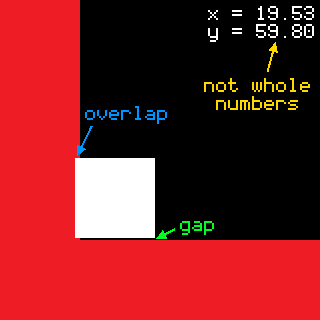
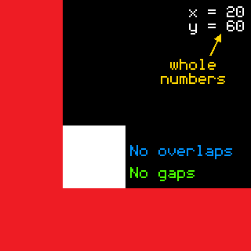

本教程旨在帮助任何在碰撞代码中出现间隙/重叠的人。本教程的目的是通过使用像素和子像素完美碰撞系统提供一种解决方案来纠正这些间隙/重叠。

---

**适用GM版本** : 2022.1+

**适用目标平台** ：一切平台。

**代码下载**：[碰撞代码(GitHub)](https://github.com/CardinalCoder64/pixel-perfect-object-based-collision)

## 注意

本教程不考虑对角线/斜面碰撞。

## 开始

如果您学过以前的碰撞代码教程，那么您应该熟悉基本碰撞的常见设置方式。

```gml
if place_meeting(x+hspd,y,oWall) {
    while !place_meeting(x+sign(hspd),y,oWall) {
        x += sign(hspd);
    }
    hspd = 0;
}
x += hspd;
```

...然后用同样的方法检查垂直碰撞。

这段代码很好，当然也是检查碰撞的一种方法。但是，它并不完美。让我来解释一下原因。

当我们以整数增量移动时（移动速度不包含小数），这个系统应该完美运行。没有间隙，没有重叠。完全像素完美。对吗？当然不是。一旦我们添加了小数运动（如摩擦力、加速度或重力），情况就会变得一团糟。您可能会在游戏中发现缝隙/重叠，这可不是什么好事，因为这会破坏玩家的体验。例如，下图显示了一个移动速度为 0.99 的玩家（白色方块）在使用上述碰撞系统时与墙壁（红色方块）发生的碰撞。正如你所看到的，其中存在一些问题。有一个间隙、一个重叠，而且 x 和 y 坐标不是整数，这意味着玩家与墙壁并不平齐。




这样做的原因是，如果我们以小数速度移动，并使用此碰撞代码接近墙壁，代码会检查我们是否距离墙壁 0.99 个像素，如果是，则 “while”循环会将我们向前移动 *一整个像素*。我们并不想向前移动 1 个像素，而是想移动 0.99 个像素，以便与墙壁齐平。为了解决这个问题，我们可以减小向墙壁移动的速度，但还是不够精确。

那么我们该如何解决这个问题呢？我有一个简单的解决方案。我们可以在与墙壁发生碰撞之前将玩家 "固定" 在墙壁上，这样玩家就能准确地到达他需要到达的位置。因此，如果我们从右侧靠近一堵墙，我们可以用墙的左侧来匹配玩家的右侧。为此，我们需要先建立几个变量。

```gml
var sprite_bbox_top = sprite_get_bbox_top(sprite_index) - sprite_get_yoffset(sprite_index);
var sprite_bbox_bottom = sprite_get_bbox_bottom(sprite_index) - sprite_get_yoffset(sprite_index) + 1;
var sprite_bbox_left = sprite_get_bbox_left(sprite_index) - sprite_get_xoffset(sprite_index);
var sprite_bbox_right = sprite_get_bbox_right(sprite_index) - sprite_get_xoffset(sprite_index) + 1;
```

这些变量为我们提供了玩家原点与边界框两侧之间的距离，这对稍后重新对齐玩家非常有用。对于 “底部” 和 “右侧”，我们必须加上 1（[本视频](https://www.youtube.com/watch?v=STYULbJ1Kkg&t=9s&ab_channel=ShaunSpalding) 中解释了原因）。如果你看过 [@GMWolf](https://forum.gamemaker.io/index.php?members/642/) 关于 [瓦片贴图碰撞](https://www.youtube.com/watch?v=7NHJ6A34V6I&ab_channel=GMWolf) 的视频，那么这应该很熟悉。

> 译者：以上视频均为Youtube视频，国内无法观看。我若是有时间可能会搬运一下。

**注意**：如果您的碰撞遮罩与精灵本身不同，请将 `sprite_index` 更改为 `mask_index`。 使用 Ctrl+F 查找并替换

好了，这是我们新碰撞系统的代码：

```gml
//Snap coordinates
snap_x = 0;
snap_y = 0;
    
//Collisions (no slopes)
//Horizontal
for(var h=0;h<=ceil(abs(hspd));h++) {//Necessary for overspeed
    var wall_x = collision_real_id(h*sign(hspd),0,oWall);//See edit below for "collision_real_id" function
    if wall_x != noone {
        var wall_left = wall_x.bbox_left;
        var wall_right = wall_x.bbox_right;
        if x < wall_left {//right
            snap_x = wall_left-sprite_bbox_right;
        } else if x > wall_right {//left
            snap_x = wall_right-sprite_bbox_left;
        }
        hspd = 0;
    }
}

//Vertical
for(var v=0;v<=ceil(abs(vspd));v++) {//Necessary for overspeed
    var wall_y = collision_real_id(0,v*sign(vspd),oWall);//See edit below for "collision_real_id" function
    if wall_y != noone {
        var wall_top = wall_y.bbox_top;
        var wall_bottom = wall_y.bbox_bottom;
        if y < wall_top {//down
            snap_y = wall_top-sprite_bbox_bottom;
        } else if y > wall_bottom {//up
            snap_y = wall_bottom-sprite_bbox_top;
        }
        vspd = 0;
    }
}
    
x += hspd;
y += vspd;
if snap_x != 0 x = snap_x;
if snap_y != 0 y = snap_y;
```

好了，让我们来分解一下。首先，我们将捕捉坐标初始化为零。这些坐标将用于在脚本结束时将玩家固定在墙上。然后，我们开始编写碰撞代码。我们创建一个 “for” 循环，检查是否与玩家前方每个像素的墙壁发生碰撞。这是超速校正所必需的，这样当玩家的移动速度大于墙壁的宽度时，玩家仍会发生碰撞（感谢 [@Happy_Malware](https://forum.gamemaker.io/index.php?members/84434/) 指出这个问题）。然后，我们使用 “collision_real_id”（参见下面的后记）进行碰撞检查，检查玩家前方的每个像素。如果发现墙壁，就会发生碰撞。我们会获取墙壁的边界框，并将其与玩家坐标进行比较。举例来说，如果玩家的 x 坐标小于墙壁的 bbox_left 坐标，我们就会将 snap_x 设置为墙壁的 bbox_left 减去玩家的 x 偏移量。这样，如果玩家正在向右移动，而我们从右侧撞上了墙壁，我们就会使用墙壁的左侧来校正玩家的位置，并将其定位于墙壁。然后，我们对所有其他方向：左、下、上也做同样的操作。

这样就完成了！结果如下（玩家的移动速度仍为 0.99）：



如你所见，玩家与墙壁完全平齐。没有缝隙，没有重叠，而且我们的 x 坐标和 y 坐标都是整数。*这是* 完美的像素。

真的就是这样。你可以将这段代码插入玩家的 “步骤 ”事件中，或者将其全部放入脚本中，然后在脚本中调用。

希望本教程对你有所帮助。

## 后记

我注意到，在使用非常小的速度（我发现低于 0.25）时，“instance_place” 似乎无法正常工作，系统会崩溃。我发现在使用该系统时，每当玩家以低于 0.25 的速度与墙壁碰撞时，他们都会 “跳” 到相应的位置。我认为这是因为 “instance_place” 有一个公差值，玩家必须在墙壁内达到一定数量的子像素才会发生碰撞。幸运的是，我已经开发出了一种解决方案，可以直接比较调用实例（玩家）和碰撞实例（墙壁）的边界框，从而获得精确的碰撞，而无需使用公差值。这是一个我称之为 “collision_real” 的脚本，有两个版本： “collision_real(obj)”，如果与给定对象发生碰撞，则返回 true；“collision_real_id(obj)”，在发生碰撞时返回碰撞对象的 id。

以下是两个脚本的代码：

> collision_real

```gml
///@arg x_offset
///@arg y_offset
///@arg obj

/*
    - 检查是否与给定对象发生碰撞
    但不包括应用于 GM “place_meeting” 的附加公差值。
    - 如果与给定对象发生碰撞，则返回 true
    - 不要为 x_offset 或 y_offset 添加 x 或 y！
*/

function collision_real(argument0,argument1,argument2) {
    var x_offset = argument0;
    var y_offset = argument1;
    var obj = argument2;
    var collision_detected = false;

    for(var i=0;i<instance_number(obj);i++) {
        var obj_id = instance_find(obj,i);
   
        if bbox_top + y_offset < obj_id.bbox_bottom
        && bbox_left + x_offset < obj_id.bbox_right
        && bbox_bottom + y_offset > obj_id.bbox_top
        && bbox_right + x_offset > obj_id.bbox_left {
            collision_detected = true;
        }
    }

    return collision_detected;
}
```

> collision_real_id

```gml
///@arg x_offset
///@arg y_offset
///@arg obj

/*
    - 检查碰撞实例与给定对象之间的碰撞
    与给定对象之间的碰撞，但不添加
    应用到 GM 的 “instance_place” 上
    - 碰撞后返回对象的 ID
    - 不要为 x_offset 或 y_offset 添加 x 或 y！
*/

function collision_real_id(argument0,argument1,argument2) {
    var x_offset = argument0;
    var y_offset = argument1;
    var obj = argument2;
    var collision_id = noone;

    for(var i=0;i<instance_number(obj);i++) {
        var obj_id = instance_find(obj,i);
   
        if bbox_top + y_offset < obj_id.bbox_bottom
        && bbox_left + x_offset < obj_id.bbox_right
        && bbox_bottom + y_offset > obj_id.bbox_top
        && bbox_right + x_offset > obj_id.bbox_left {
            collision_id = obj_id;
        }
    }

    return collision_id;
}
```

使用时，请在项目中创建一个脚本（随心所欲地命名），然后将代码复制/粘贴到脚本中（或使用上面的 GitHub 链接）。这应该能修复这个小错误。

其他已知问题：

\- 不考虑多个碰撞对象

\- 与玩家一起缩放图像的问题