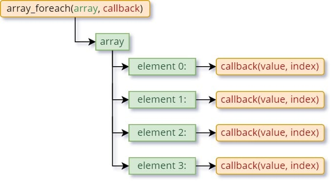
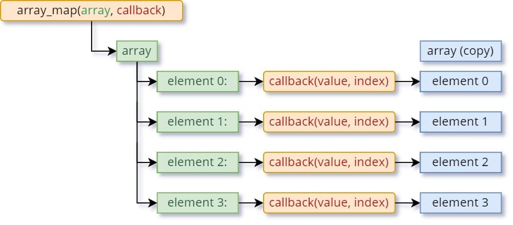
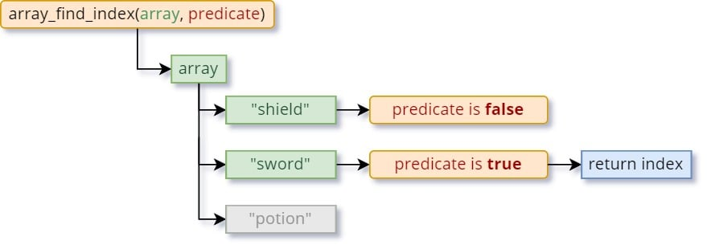
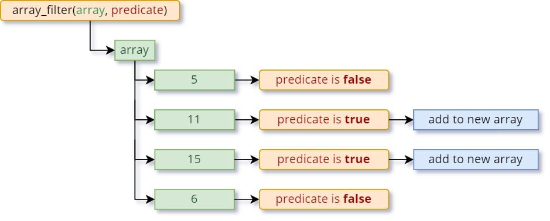
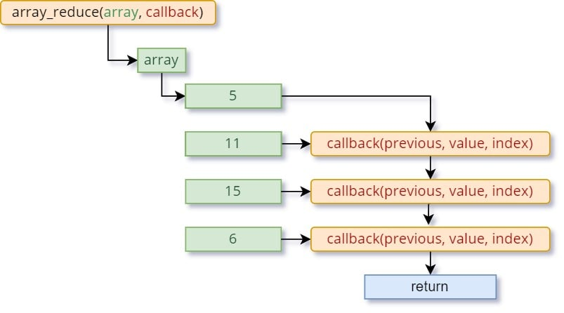

GameMaker有一些[新函数](https://gamemaker.io/en/blog/release-2022-11)，它们提供了更简单、更强大的方法来读取和修改数组。

其中许多函数利用了“回调方法”，这可能会让人感到困惑。

因此，让我们来逐步解释吧！

## 什么是数组？

如果你对数组不熟悉，[这个手册页面](/tool/manual.html?path=GameMaker_Language/GML_Overview/Arrays.htm)应该会给你一个很好的概述。

许多数组函数使用了“方法”，所以我建议阅读关于[手册中的方法](/tool/manual.html?path=GameMaker_Language/GML_Overview/Method_Variables.htm)。

## 回调基础

**[array_foreach()](/tool/manual.html?path=GameMaker_Language/GML_Reference/Variable_Functions/array_foreach.htm)** 函数是使用回调的最简单的示例。

你拿一个数组，运行 **array_foreach()**，并给它一个要运行的方法/函数。对于数组中的每个元素，都会运行你的回调方法。



“回调方法”只是你自己制作的一个简单方法。

它基本上是在一本书中翻转每一页，告诉你“这是一页！”，以及关于那一页的信息。

### 示例

让我们在一个包含4个元素（值）的数组上调用 **array_foreach()**。 **array_foreach()** 遍历数组，并为每个元素运行你的回调，如上所示。

**array_foreach()** 还向你的回调提供了两个参数：该元素的**值**和其**索引**（**0**，**1**，**2**，等等...）。

下面是一个代码示例：

```gml
var _array = [11, 22, 33, 44, 55];

array_foreach(_array, function(_val, _index)
{
        show_debug_message("{0} at index {1}", _val, _index);
});
```

这个代码在一个数组上运行 **array_foreach**，将每个元素的值和索引打印到输出日志中：

> 11 at index 0
>
> 22 at index 1
>
> 33 at index 2
>
> 44 at index 3
>
> 55 at index 4

你可以以更清晰的方式编写相同的代码，先定义方法，然后将其传递给 **array_foreach()** 调用：

```gml
var _array = [11, 22, 33, 44, 55];

var _callback = function(_val, _index)
{
        show_debug_message("{0} at index {1}", _val, _index);
}

array_foreach(_array, _callback);
```

## ARRAY_MAP

让我们再深入一步。

**[array_map()](/tool/manual.html?path=GameMaker_Language/GML_Reference/Variable_Functions/array_map.htm)** 的工作方式与前一个函数相同：它接受一个数组和一个回调方法，并在每个数组元素上运行你的回调。

但这一次，你的回调方法实际上被允许返回一个值。

这允许你更改数组中的元素。你的回调返回的内容被应用回到同一个元素，但是在数组的一个新副本中。



在函数结束时，它会给你修改后的数组。原始数组不会改变。

让我们使用这个函数来将我们的数组中的所有值都加倍：

```gml
var _array = [11, 22, 33, 44, 55];

var _callback = function(_val, _index)
{
        return _val * 2;
}

var _new_array = array_map(_array, _callback);
show_debug_message(_new_array);
```

数组与之前相同，回调只是返回值乘以2。

然后我们将其传递给 **array_map()**，它创建一个所有值都加倍的新数组，感谢我们的回调。

然后将新数组打印到输出日志中，所以你应该会看到这个：

> [ 22,44,66,88,110 ]

## 谓词方法

一些数组函数使用[谓词方法](/tool/manual.html?path=GameMaker_Language/GML_Reference/Variable_Functions/Array_Functions.htm#h)。别担心，它只是一个具有一个特定要求的回调方法。

如果你的回调方法只能返回**true**或**false**，那么它就是一个谓词方法。

这样的函数用于告诉一个元素是否符合条件。通过这种技术，你可以对数组执行许多种操作。

## 查找索引

你有一个库存数组，你想知道里面是否有一把剑。你还想知道剑在数组中的确切位置。

**[array_find_index()](/tool/manual.html?path=GameMaker_Language/GML_Reference/Variable_Functions/array_find_index.htm)** 正好可以做到这一点。它接受一个谓词方法，当该方法返回**true**时，它会给你返回**true**的元素的索引。

让我们使用数组：**[“shield”, “sword”, “potion”]**，并运行 **array_find_index()** 来查找 “sword” 元素。这是它的工作原理：



这是代码的样子：

```gml
var _array = ["shield", "sword", "potion"];

var _predicate = function (_val, _index)
{
        return _val == "sword";
}

var _sword_id = array_find_index(_array, _predicate);

show_debug_message(_sword_id);
```

在这里，谓词函数在值等于**sword**时返回**true**，否则返回**false**。

然后我们将其传递给 **array_find_index()**，它给了我们**1**，即找到字符串**sword**的索引。

## all 和 filter

**[array_all()](/tool/manual.html?path=GameMaker_Language/GML_Reference/Variable_Functions/array_all.htm)** 允许你在数组中的所有元素上运行一个谓词方法，并且如果你的谓词对所有元素都返回**true**，它就会返回**true**。

这可以用来判断数组中的每个元素是否相同，或者是否满足某个条件。

**[array_filter()](/tool/manual.html?path=GameMaker_Language/GML_Reference/Variable_Functions/array_filter.htm)** 也使用谓词，并创建一个只包含符合条件的元素的新数组。这样，你可以使用谓词函数作为条件来过滤数组，删除不需要的任何内容。

假设你有数组：**[5, 11, 15, 6]**，你只想要大于10的值。**array_filter()** 就会为你做到这一点： 



## REDUCE

**[array_reduce()](/tool/manual.html?path=GameMaker_Language/GML_Reference/Variable_Functions/array_reduce.htm)** 允许你在每个元素上运行一个回调并返回某个值。你为一个元素返回的任何值都将传递到下一个回调中。这样，你可以按顺序处理你的数组。

最后，你得到了你的回调为最后一个元素返回的任何值。



你可以看到回调不会对第一个元素运行。它从第二个元素（**11**）作为当前“值”开始，第一个元素（**5**）作为“前一个”参数传递进去。

你第一个回调返回的值被传递到下一个回调中作为“前一个”值，然后该回调的返回值被传递到下一个回调中，直到它遍历完所有元素。

你可以选择指定一个起始值，该值被传递到第一个回调中，如果你这样做了，你的回调也将运行第一个元素。

## 更多数组函数

**[array_create_ext()](/tool/manual.html?path=GameMaker_Language/GML_Reference/Variable_Functions/array_create_ext.htm)** 允许你使用回调方法创建一个新数组。这个回调对每个元素运行，并且其返回值被存储在该元素中。

当你想要生成一个具有一系列值的数组，或者使用一些计算来生成数组元素时，这是非常有用的。

```gml
var _array = array_create_ext(10, function(_index)
{
        return 1 + _index;
});

show_debug_message(_array);
```

这将创建一个数组，其中每个元素都增加了1，给你这个数组：[ 1, 2, 3, 4, 5, 6, 7, 8, 9, 10 ]

还有一些用不同方式连接数组的函数：

- **[array_concat()](/tool/manual.html?path=GameMaker_Language/GML_Reference/Variable_Functions/array_concat.htm)** 将给定的数组连接成一个数组

- **[array_union()](/tool/manual.html?path=GameMaker_Language/GML_Reference/Variable_Functions/array_union.htm)** 将给定的数组连接起来，移除重复项

- [array_intersection()](/tool/manual.html?path=GameMaker_Language/GML_Reference/Variable_Functions/array_intersection.htm)

   给你存在于所有给定数组中的值

  - 例如，如果你给它三个数组，数字 **64** 在所有数组中都存在，它将被包含在内
  - 但是如果数字 **48** 只存在于第一个和第三个数组中，而不在第二个数组中，它将不被包含在内

在手册中查看更多[数组函数](/tool/manual.html?path=GameMaker_Language/GML_Reference/Variable_Functions/Array_Functions.htm)。

**祝愉快的游戏开发！**